# Montageablauf Fliehkraftkupplung – Schritt für Schritt

Die komplette Baugruppe (Pos. 1–12, 43 Einzelteile) ist in der Reihenfolge aufgebaut, in der man die Kupplung auch wirklich montiert:
zuerst zwei Unterbaugruppen (Nabe mit Fliehgewichten; Gehäuse mit Abtriebsnabe), dann die Endmontage.
Farben in den Bildern: **orange** = neu eingebaut, **blau** = Stifte, Ringe, Schrauben, **rot** = Federn, **grün** = Lager, **gelb** = Filzring, **grau** = bereits montiert.
Die Druckversion steht in `Montageablauf_Fliehkraftkupplung.pdf`.

## So bin ich vorgegangen

1. **Daten gesichtet:** STEP-Modelle von Pos. 1, 2, 4, 5 und 7, Einzelteilzeichnungen 14.2.5.x und die Stückliste.
2. **Einbaulage bestimmt:** Achse = X. Für jedes STEP-Teil habe ich die Passflächen gesucht (Lagersitze Ø45/Ø75, Zentrierung Ø136, Flansche, Lochkreis Ø150) und das Teil daran ausgerichtet.
3. **Fehlende Teile modelliert:** nach den Einzelteilzeichnungen (Pos. 3, 6, 9) oder nach den Normen (Pos. 8 DIN 6799, Pos. 10 ISO 4762, Pos. 11 DIN 625, Pos. 12 DIN 5419). Die Zugfeder ist gespannt modelliert.
4. **Zusammengebaut** in Montagereihenfolge (siehe unten).
5. **Kollisionsprüfung:** jedes Teil gegen jedes andere (903 Paare). Gefunden und behoben:
   - Lager ↔ Nabe und Abtriebsnabe: Die Lagerringe hatten scharfe Kanten → Fase 0,8 mm, echte Lager haben r = 1 mm.
   - Fliehgewicht ↔ Stift: Die Bohrungsmitte war gerundet eingegeben → exakter Wert aus dem STEP.
   - Filzring ↔ Deckel: Rechenungenauigkeit an der Nutflanke → 0,02 mm Luft.
   - Lager ↔ Schulter: 0,003 mm Überdeckung, das ist reine Flächenanlage → 0,005 mm Luft.
   - Feder und Sicherungsscheibe: Die Lage habe ich nach der Stiftzeichnung korrigiert (Nut 7 mm, Einstich 3 mm vom Stiftende).
   - Ergebnis: **0 Überschneidungen** (die Schrauben im Gewinde sind gewollt und ausgenommen).
6. **Bilder gerendert:** pro Schritt ein Bild, bei den kleinen Teilen zusätzlich eine Detailansicht.

## Datengrundlage je Teil

| Pos. | Teil | Quelle |
|---|---|---|
| 1 | Antriebsnabe | STEP (Datensatz) |
| 2 | Abtriebsnabe | STEP (Datensatz) |
| 3 | Gehäuse | Zeichnung 14.2.5.4 |
| 4 | Deckel | STEP (Datensatz) |
| 5 | Fliehgewicht 5.1 + 5.2 | STEP (Datensatz) |
| 6 | Scheibe | Zeichnung 14.2.5.7 |
| 7 | Zugfeder | Zeichnung 14.2.5.8, gespannt modelliert |
| 8 | Sicherungsscheibe | DIN 6799 – 7, vereinfacht |
| 9 | Zylinderstift | Zeichnung 14.2.5.9 |
| 10 | Zylinderschraube | ISO 4762 M8 × 20, Gewinde nicht dargestellt |
| 11 | Rillenkugellager | DIN 625 6009-2Z (d 45 / D 75 / B 16), Innenleben vereinfacht |
| 12 | Filzring | DIN 5419, Form aus der Deckelnut |

Für jedes Teil gab es genug Informationen. Kein Teil musste weggelassen werden.

## Schritt 1: Antriebsnabe (1) bereitlegen

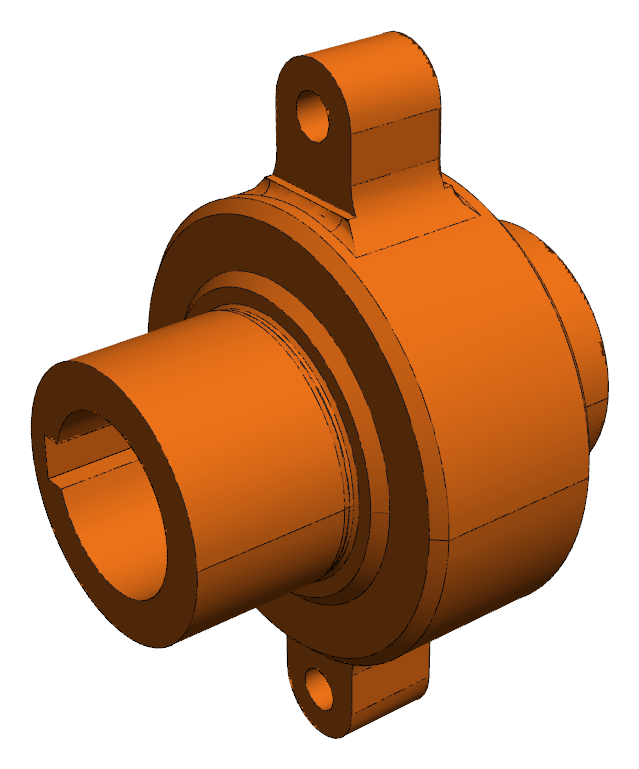

- **Was:** Die Antriebsnabe ist das Basisteil der Unterbaugruppe „Nabe“. Alle beweglichen Teile hängen an ihren zwei Armen.
- **Creo:** Komponente einbauen → Abhängigkeit „Standard“ (fixiert).
- **Hinweis:** Arme mit den Bohrungen Ø8H8 zeigen nach oben und unten (Abstand 104 mm).

## Schritt 2: Scheiben (6) an die Arme legen

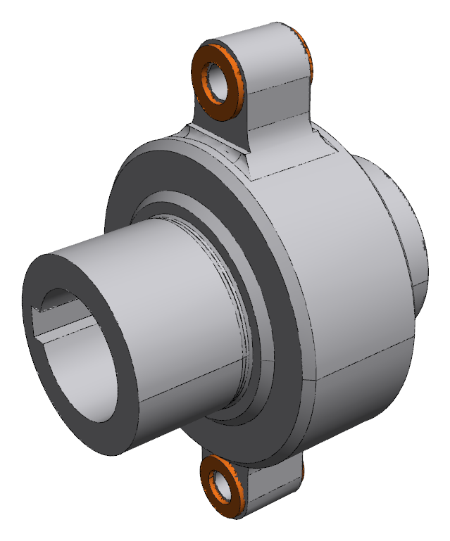

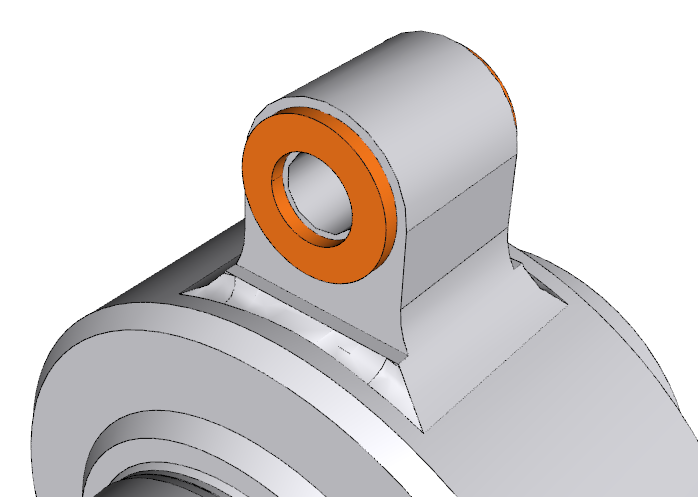

- **Was:** Je Arm links und rechts eine Scheibe 16 × 9 × 1,5 → 4 Stück.
- **Creo:** Achse Scheibe koinzident Achse Armbohrung, Planfläche Scheibe koinzident Seitenfläche Arm.
- **Hinweis:** Warum? Die Nut im Fliehgewicht ist 20 mm breit, der Arm nur 17 mm: 17 + 2 × 1,5 = 20. Die Scheiben füllen das Spiel und sind Anlaufflächen.

## Schritt 3: Fliehgewichte (5) über die Arme schieben

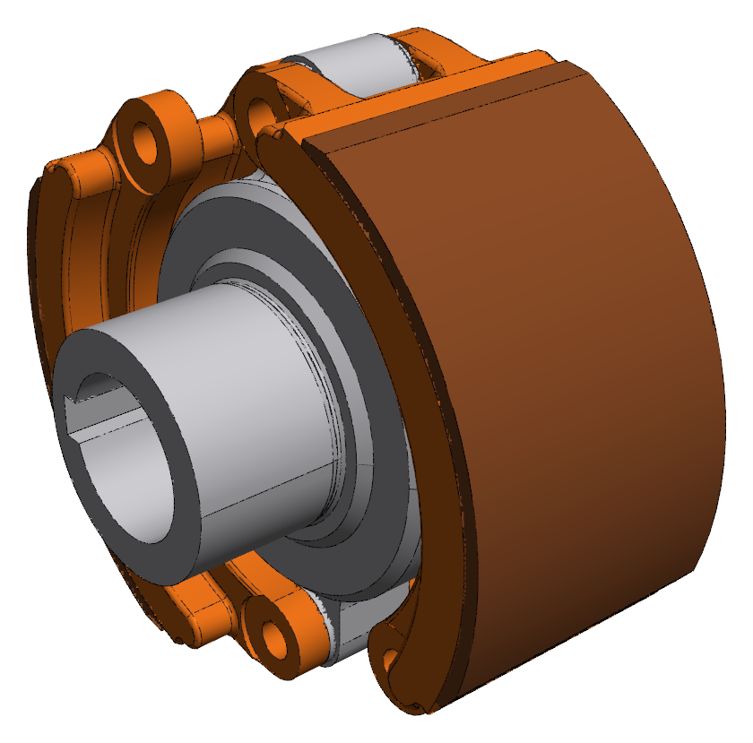

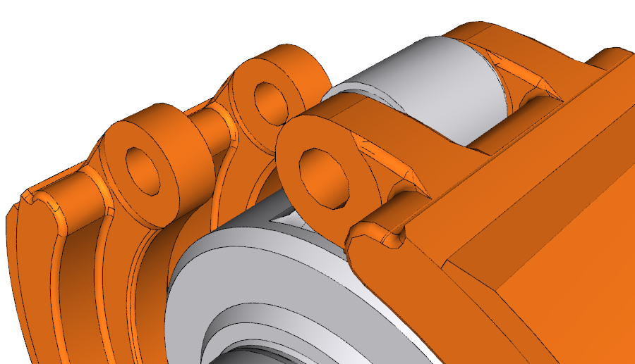

- **Was:** Fliehgewicht = Gewicht 5.1 mit aufgeklebtem Reibbelag 5.2 (vorher zusammengebaut). Gewicht 1 am oberen Arm, Gewicht 2 am unteren Arm (punktsymmetrisch).
- **Creo:** Bohrung Ø8H9 koaxial Armbohrung, Nutfläche koinzident Außenfläche Scheibe, Winkelversatz 68,1° (RIGHT Gewicht ↔ FRONT Nabe).
- **Hinweis:** In Ruhelage hat der Belag ca. 2,7 mm Luft zum späteren Gehäuse.

## Schritt 4: Zylinderstifte (9) einstecken

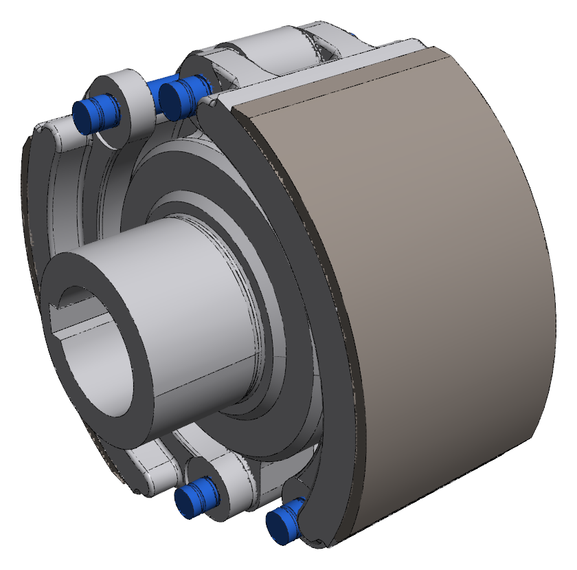

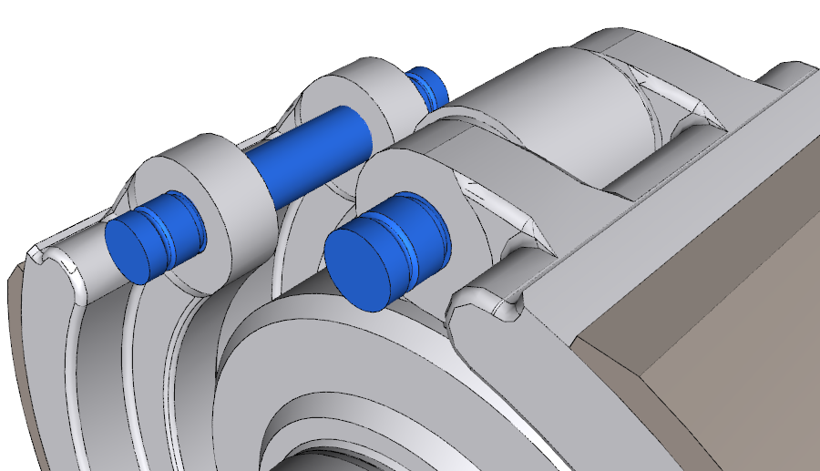

- **Was:** 4 Stifte: 2 als Drehpunkt (durch Arm, Scheiben und Gewicht), 2 in den freien Enden der Gewichte (dort werden die Federn eingehängt).
- **Creo:** Achse Stift koaxial Bohrung, Stift mittig: Stiftmitte = Mitte Gewicht (25 mm nach jeder Seite).
- **Hinweis:** Stift Ø8h8 in Bohrung Ø8H8/H9 → Spielpassung, das Gewicht kann schwenken.

## Schritt 5: Sicherungsscheiben (8) aufschieben

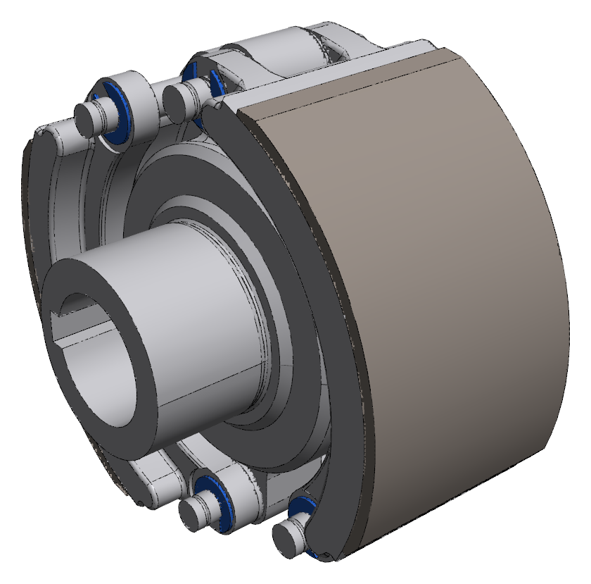

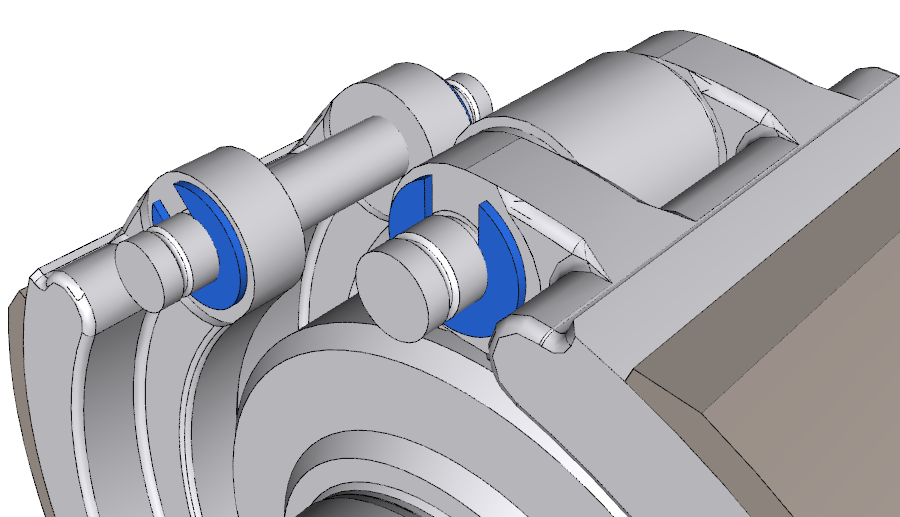

- **Was:** 8 Stück DIN 6799 – 7 in die Nuten Ø7 der Stifte (7 mm vom Stiftende).
- **Creo:** Achse koaxial Stift, Planfläche an Nutflanke bzw. an Gewichtsauge.
- **Hinweis:** Sie verhindern, dass die Stifte axial herauswandern.

## Schritt 6: Zugfedern (7) einhängen

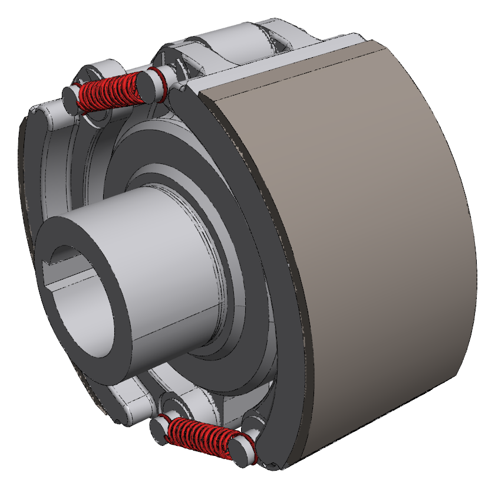

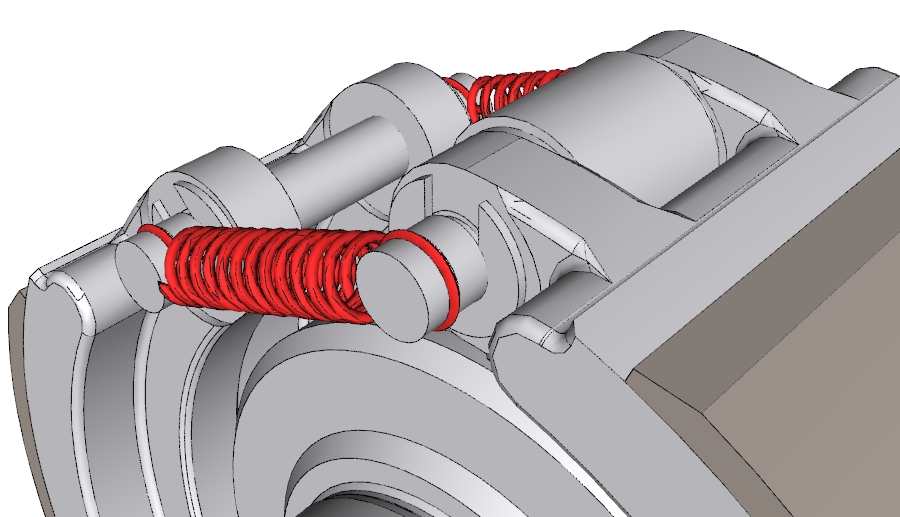

- **Was:** 4 Federn: je eine vorne und hinten. Feder 1 verbindet den oberen Drehpunkt mit dem freien Ende von Gewicht 2, Feder 2 den unteren Drehpunkt mit dem freien Ende von Gewicht 1.
- **Creo:** Öse koaxial Stiftachse, Ösenebene in den Einstich R0,6 (3 mm vom Stiftende).
- **Hinweis:** Die Federn sind gespannt eingebaut (Ösenabstand 38,8 mm statt 22,9 mm frei) und ziehen die Gewichte nach innen. Erst wenn die Fliehkraft größer ist, legen sich die Beläge an.

## Schritt 7: Rillenkugellager (11) aufpressen

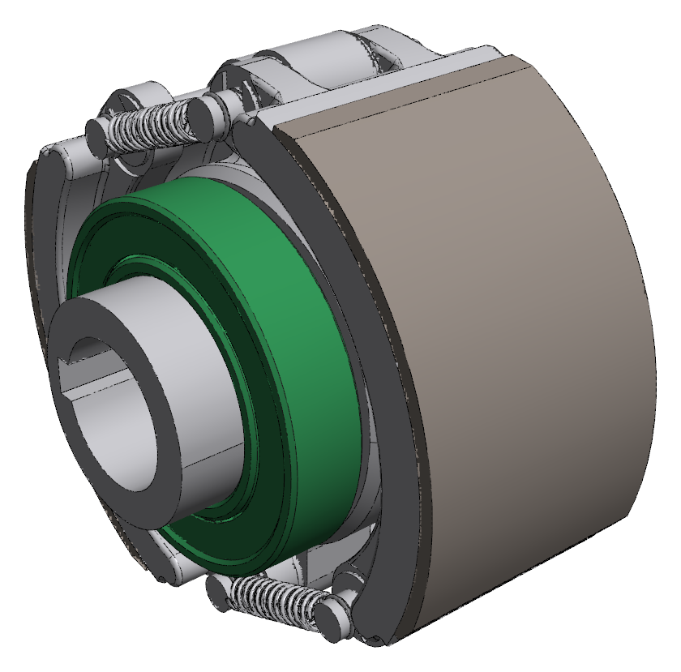

- **Was:** 2 Lager 6009-2Z auf die Lagersitze Ø45k6 bis zur Wellenschulter.
- **Creo:** Bohrung Lager koaxial Lagersitz, Stirnfläche Innenring koinzident Wellenschulter.
- **Hinweis:** Ø45k6 ist eine Übergangspassung → Lager aufpressen. Die Kraft nur über den Innenring einleiten, sonst werden Kugeln und Laufbahn beschädigt. Damit ist die Unterbaugruppe „Nabe“ fertig.

## Schritt 8: Gehäuse (3) mit Abtriebsnabe (2) verschrauben

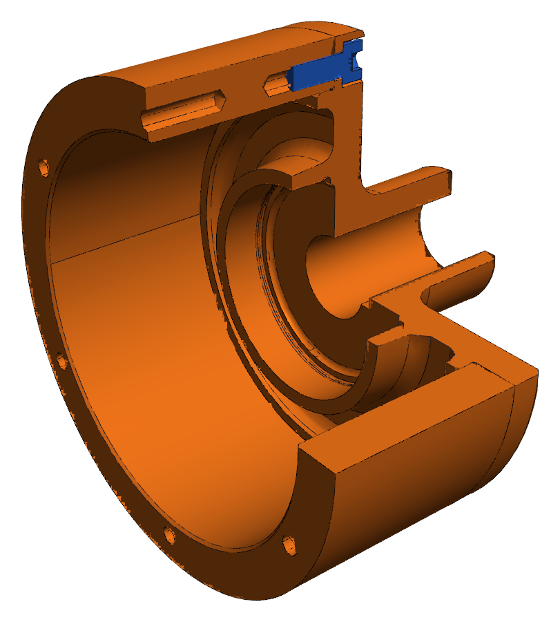

- **Was:** Zweite Unterbaugruppe: das Gehäuse wird über die Zentrierung Ø136 H7/h6 auf die Abtriebsnabe gesteckt und mit 6 Zylinderschrauben ISO 4762 M8 × 20 (10) verschraubt.
- **Creo:** Achse koaxial, Planfläche Gehäuse koinzident Flansch Abtriebsnabe, Achse Gewindebohrung koaxial Durchgangsbohrung.
- **Hinweis:** Schrauben über Kreuz anziehen. Die Köpfe liegen versenkt in den Senkungen Ø15H13.

## Schritt 9: Nabe einschieben

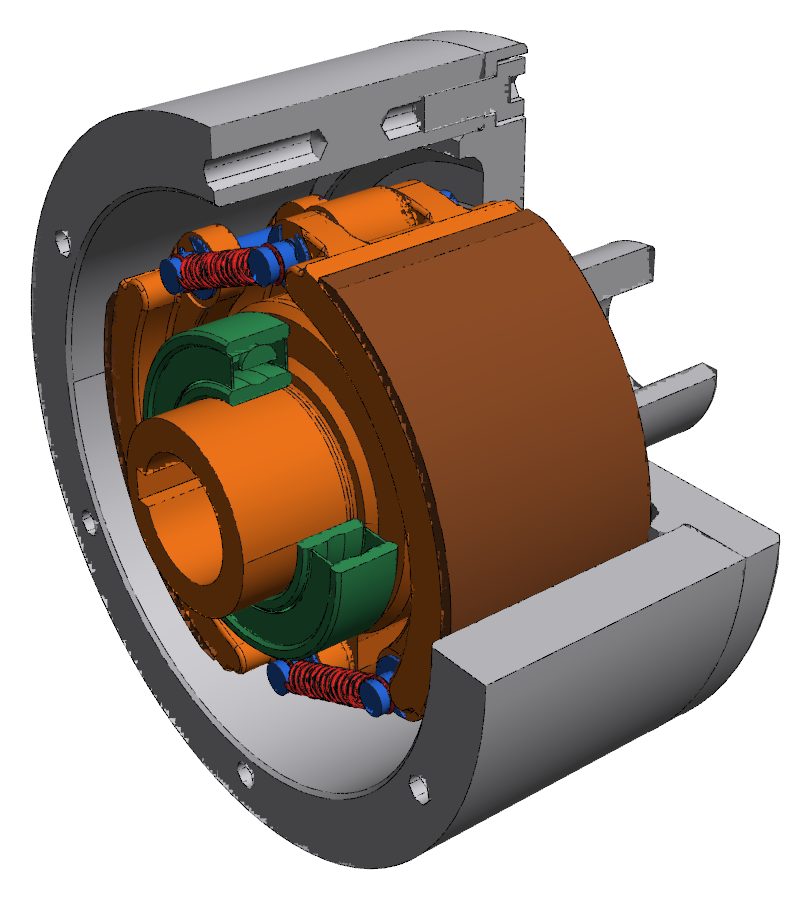

- **Was:** Die vormontierte Nabe wird mit dem rechten Lager in den Lagersitz Ø75H7 der Abtriebsnabe geschoben, bis der Außenring an der Schulter anliegt.
- **Creo:** Außenring koaxial Lagersitz, Stirnfläche Außenring koinzident Schulter.
- **Hinweis:** Viertelschnitt: so sieht man das Innenleben im Gehäuse.

## Schritt 10: Filzring (12) in den Deckel (4)

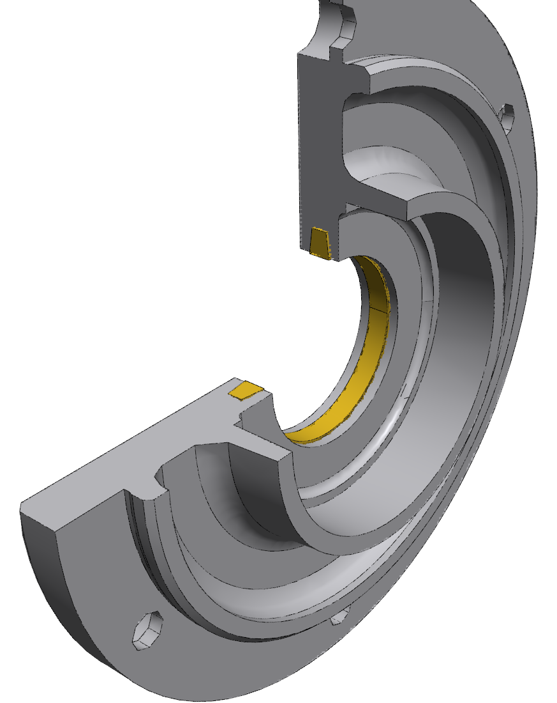

- **Was:** Der Filzring DIN 5419 wird in die trapezförmige Nut Ø58H12 / 4H13 / 14° des Deckels eingelegt.
- **Creo:** Achse koaxial, Ring in der Nut zentriert.
- **Hinweis:** Vor dem Einbau in Öl tränken. Der Filzring dichtet nach außen gegen Staub ab, er dichtet nicht das Lager.

## Schritt 11: Deckel aufsetzen und verschrauben

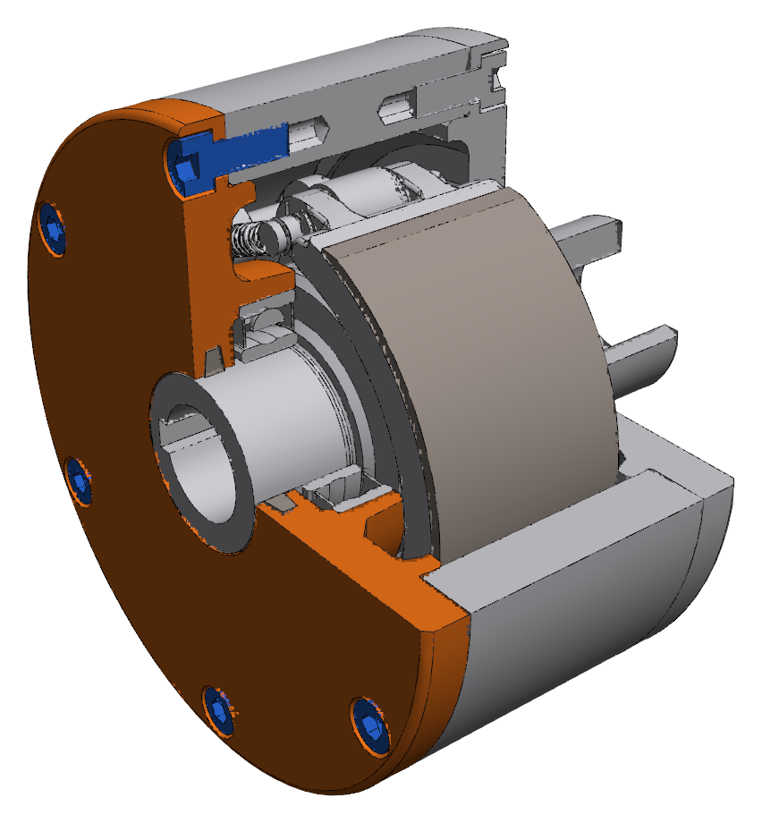

- **Was:** Der Deckel geht gleichzeitig über das linke Lager (Ø75H7) und mit der Zentrierung Ø136h6 ins Gehäuse. Danach 6 Schrauben M8 × 20 anziehen.
- **Creo:** Achse koaxial, Flanschfläche Deckel koinzident Stirnfläche Gehäuse, Bohrungen fluchtend mit den Gewinden.
- **Hinweis:** Der Filzring gleitet dabei über den Lagersitz der Antriebsnabe.

## Schritt 12: Fertige Fliehkraftkupplung

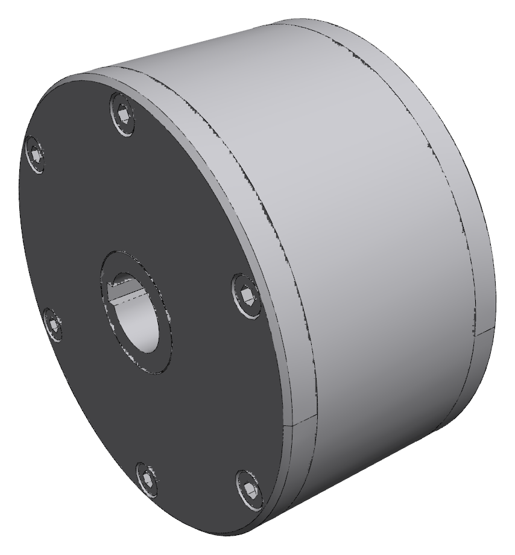

- **Was:** Alle 12 Positionen sind eingebaut (43 Einzelteile).
- **Creo:** Kontrolle: Antriebsnabe von Hand drehen → sie muss sich leicht drehen lassen, das Gehäuse bleibt stehen (Kupplung offen).
- **Hinweis:** Die Kollisionsprüfung der kompletten Baugruppe ergibt 0 Überschneidungen.
