# Modellbaum der Einzelteile – Creo Parametric 12

Für jedes Teil steht hier, wie man es in Creo **KE für KE** aufbaut: Reihenfolge, Skizzierebene, Skizze mit Maßen und das Sollvolumen zur Kontrolle.
Die gleiche Anleitung gibt es als PDF: `Modellbaum_Einzelteile.pdf` (eine Seite pro Teil).

Ich habe jede Anleitung mit einem Skript Schritt für Schritt nachgebaut (`Skripte/replay.py`). Die Sollvolumen stammen aus diesem Nachbau.

## Grundregeln

- Neues Teil: Datei → Neu → Teil / Volumenkörper, Haken bei „Standardvorlage verwenden“ weg → Vorlage mmns_part_solid_abs (mm, N, s).
- Drehteile (Pos. 1, 2, 3, 4, 9, 12): Skizze auf FRONT. Zuerst eine Geometrie-Mittellinie auf die waagrechte Referenz legen (= Drehachse). Gezeichnet wird nur der halbe Querschnitt über der Achse. Durchmesser bemaßen: Linie → Mittellinie → nochmal Linie anklicken → mittlere Maustaste.
- Die x-Maße in den Skizzen zählen von der linken Stirnfläche (= Ebene RIGHT) aus.
- Jedes KE im Modellbaum umbenennen (Rechtsklick → Umbenennen, z. B. „Grundkörper“, „Arme“, „Passfedernut“). So kann die Lehrkraft den Aufbau sofort lesen.
- Kontrolle am Ende: Analyse → Masseneigenschaften → Volumen. Weicht dein Wert um weniger als 0,5 % vom Sollvolumen ab, stimmt das Teil (Feder: 3 %).
- Klappt eine Rundung nicht („Rundung konnte nicht erzeugt werden“), ist meist der Radius so groß wie die Fläche daneben. Dann den Bogen gleich in die Skizze zeichnen, wie hier bei allen R2 an den Lagerschultern.

## Übersicht

| Pos. | Teil | Werkstoff | KE | Sollvolumen |
|---|---|---|---|---|
| 1 | [Antriebsnabe](#pos-1) | EN-GJS-700-2 | 8 | 180.856 mm³ |
| 2 | [Abtriebsnabe](#pos-2) | EN-GJS-700-2 | 8 | 350.704 mm³ |
| 3 | [Gehäuse](#pos-3) | E295 | 6 | 559.933 mm³ |
| 4 | [Deckel](#pos-4) | EN-GJS-700-2 | 6 | 276.618 mm³ |
| 5.1 | [Gewicht (Teil des Fliehgewichts)](#pos-51) | EN-GJS-700-2 | 7 | 82.713 mm³ |
| 5.2 | [Belag (Teil des Fliehgewichts)](#pos-52) | Reibbelag | 2 | 16.096 mm³ |
| 6 | [Scheibe](#pos-6) | S235JR | 1 | 206 mm³ |
| 7 | [Zugfeder](#pos-7) | Federstahl (46Si7 laut Zeichnung) | 4 | 305 mm³ |
| 9 | [Zylinderstift](#pos-9) | C45E | 5 | 2.465 mm³ |
| 12 | [Filzring DIN 5419 – 45](#pos-12) | Filz | 1 | 5.010 mm³ |
| 8 | Sicherungsscheibe DIN 6799 – 7 | Normteil | – | – |
| 10 | Zylinderschraube ISO 4762 – M8 × 20 | Normteil | – | – |
| 11 | Rillenkugellager 6009-2Z | Normteil | – | – |

## Pos. 1 – Antriebsnabe

Werkstoff: **EN-GJS-700-2** · Vorlage: `mmns_part_solid_abs` · Grundlage: Zeichnung 14.2.5.2

| Nr | Creo-KE | Ebene / Referenz | Eingaben / Maße |
|---|---|---|---|
| 1 | Drehen (Grundkörper) | Skizze auf FRONT, Achse = Mittellinie | Skizze 1: Bohrung Ø30, Lagersitze Ø45 (links 29 lang, rechts 16 lang), Schultern Ø51 mit Bogen R2 (in der Skizze!), Mittelteil Ø77 von 31 bis 63, Länge 81. Winkel 360°. |
| 2 | Rundung | 2 Außenkanten am Ø77 (x = 31 und x = 63) | R2 |
| 3 | Ebene DTM1 | parallel zu RIGHT | Versatz 47 = Mitte der Arme |
| 4 | Extrudieren (Arme) | Skizze auf DTM1 | Skizze 2: zwei Arme, je 18 breit, Halbkreis R9 außen, Augenmitten 104 auseinander (je 52 von der Achse). Rechteck innen bis R30 in den Körper ziehen. Tiefe symmetrisch 17. |
| 5 | Rundung | 4 gerade Kanten, wo die Armseiten auf den Ø77 treffen | R9. Erst jetzt, vor dem Fuß, sonst schlägt die Rundung fehl. |
| 6 | Extrudieren (Fuß) | Skizze auf DTM1 | Je Arm Rechteck 18 breit von R30 bis R39,5 (1 mm über Ø77). Tiefe symmetrisch 20. |
| 7 | Bohrung | koaxial zur Achse des R9-Bogens, Platzierung auf der Armseite | Ø8H8, Tiefe „Durch alle“. Zweiten Arm gleich (oder Spiegeln an TOP). |
| 8 | Extrudieren, Material entfernen (Passfedernut) | Skizze auf RIGHT (Stirnfläche x = 0) | Rechteck 8 breit, symmetrisch zu TOP, von der Bohrung bis 18,3 von der Achse (= Maß 33,3, t2 = 3,3). Um 90° zu den Armen versetzt. Tiefe „Durch alle“. |

**Kontrolle:** Analyse → Masseneigenschaften → Volumen = **180.856 mm³**

*Skizze 1 – Drehen (KE 1)*

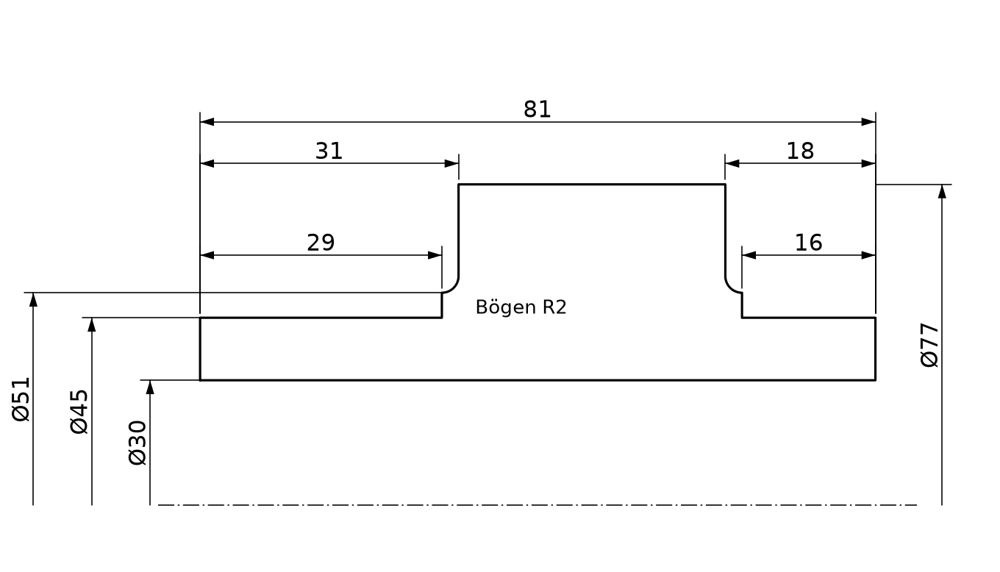

*Skizze 2 – Arme auf DTM1 (KE 4)*

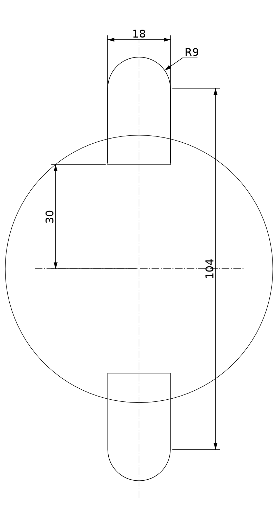

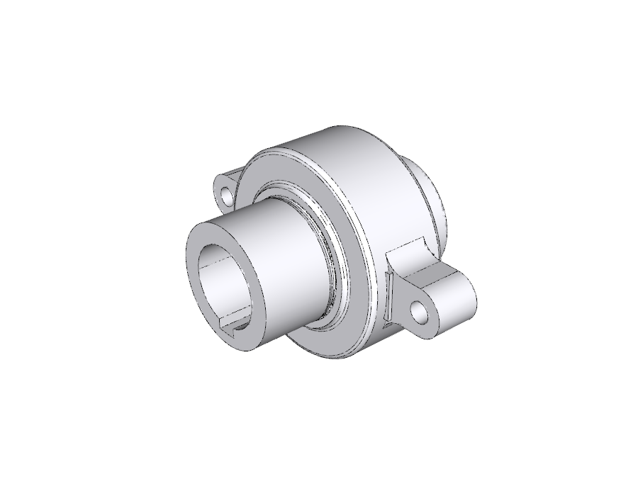

**Hinweise**

- Reihenfolge Arme → Rundung R9 → Fuß einhalten. Wer den Fuß vorher macht, bekommt bei R9 einen Fehler.
- Freistiche und Kantenbrüche aus der Zeichnung sind optional (ändern das Volumen kaum).
- Buchfehler: „Gusstoleranz DIN 1688“ → richtig DIN 1686.

## Pos. 2 – Abtriebsnabe

Werkstoff: **EN-GJS-700-2** · Vorlage: `mmns_part_solid_abs` · Grundlage: keine Zeichnung im Datensatz – Maße aus dem STEP-Modell

| Nr | Creo-KE | Ebene / Referenz | Eingaben / Maße |
|---|---|---|---|
| 1 | Drehen (Grundkörper) | Skizze auf FRONT, Achse = Mittellinie | Skizze 1: Bohrung Ø30 (Länge 54), Nabe Ø50 (Länge 43), Flansch Ø170 (43 bis 55), Zentrierring Ø136 / Ø125 bis 62, Lagerrohr außen mit 5° Aushebeschräge bis Ø85,3 bei 72, Lagersitz Ø75 (56 bis 72), Schulter Ø70 mit Bogen R2 (in der Skizze). Winkel 360°. |
| 2 | Rundung | Innenecke Nabe / Flansch (x = 43, Ø50) | R10 |
| 3 | Rundung | 2 Innenkanten am Flansch bei x = 55 (am Ø125 und am Lagerrohr) | R5 |
| 4 | Rundung | Nabe außen bei x = 0 und Flansch Ø170 bei x = 43 | R2 |
| 5 | Fase | Kante Ø136 bei x = 62 | 1,5 × 45° |
| 6 | Extrudieren, Material entfernen (Passfedernut) | Skizze auf RIGHT (Stirnfläche x = 0) | Rechteck 8 breit, symmetrisch zu TOP, bis 18,3 von der Achse (Maß 33,3). Tiefe „Durch alle“. |
| 7 | Bohrung (Senkung) | Flanschfläche x = 43, Lochkreis Ø150, 0° zu FRONT | Ø9 durchgehend, Senkung Ø15 × 8,6 tief (für ISO 4762 M8) |
| 8 | Muster | Typ Achse, Kupplungsachse | 6 Stück, 60° |

**Kontrolle:** Analyse → Masseneigenschaften → Volumen = **350.704 mm³**

*Skizze 1 – Drehen (KE 1)*

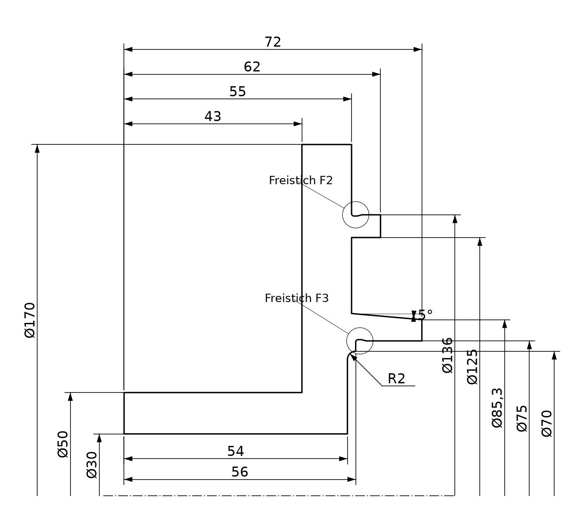

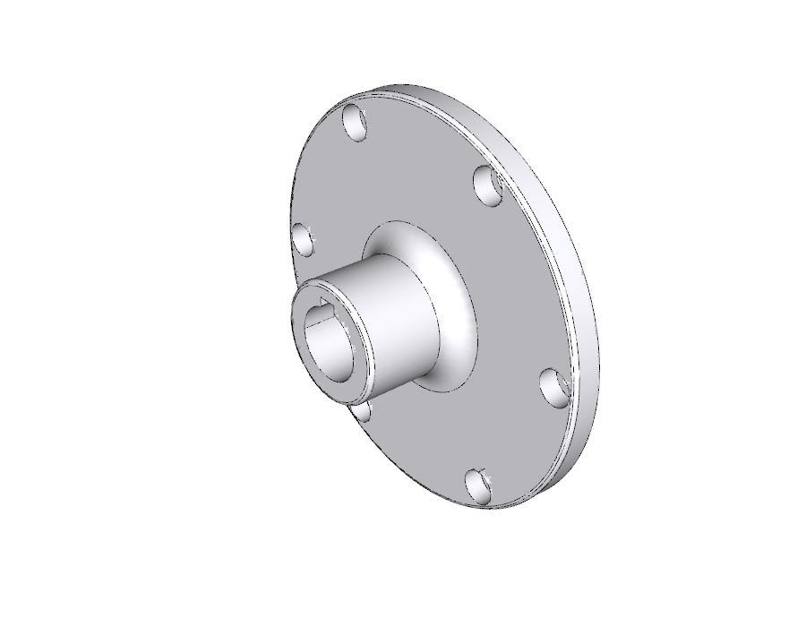

**Hinweise**

- Für Pos. 2 gibt es im Datensatz keine Zeichnung. Die Maße habe ich aus dem STEP-Modell abgelesen. Bitte mit der Lehrkraft abklären.

## Pos. 3 – Gehäuse

Werkstoff: **E295** · Vorlage: `mmns_part_solid_abs` · Grundlage: Zeichnung 14.2.5.4

| Nr | Creo-KE | Ebene / Referenz | Eingaben / Maße |
|---|---|---|---|
| 1 | Drehen (Grundkörper) | Skizze auf FRONT, Achse = Mittellinie | Skizze 1: Rechteck Länge 70, innen Ø136, außen Ø170. Winkel 360°. (Extrudieren eines Rings geht genauso.) |
| 2 | Fase | beide Innenkanten Ø136 | 1 × 45° |
| 3 | Bohrung (Standard, Gewinde) | Stirnfläche x = 0, Lochkreis Ø150, 30° zu FRONT | ISO M8 × 1,25, Gewindetiefe 20, Bohrtiefe 26 (Kernloch Ø6,8), Spitze 118°, kosmetisches Gewinde an |
| 4 | Muster | Typ Achse, Gehäuseachse | 6 Stück, 60° |
| 5 | Ebene DTM1 | parallel zu RIGHT | Versatz 35 = Gehäusemitte |
| 6 | Spiegeln | Muster aus KE 4 an DTM1 | ergibt 6 × M8 auf der anderen Seite |

**Kontrolle:** Analyse → Masseneigenschaften → Volumen = **559.933 mm³**

*Skizze 1 – Drehen (KE 1)*

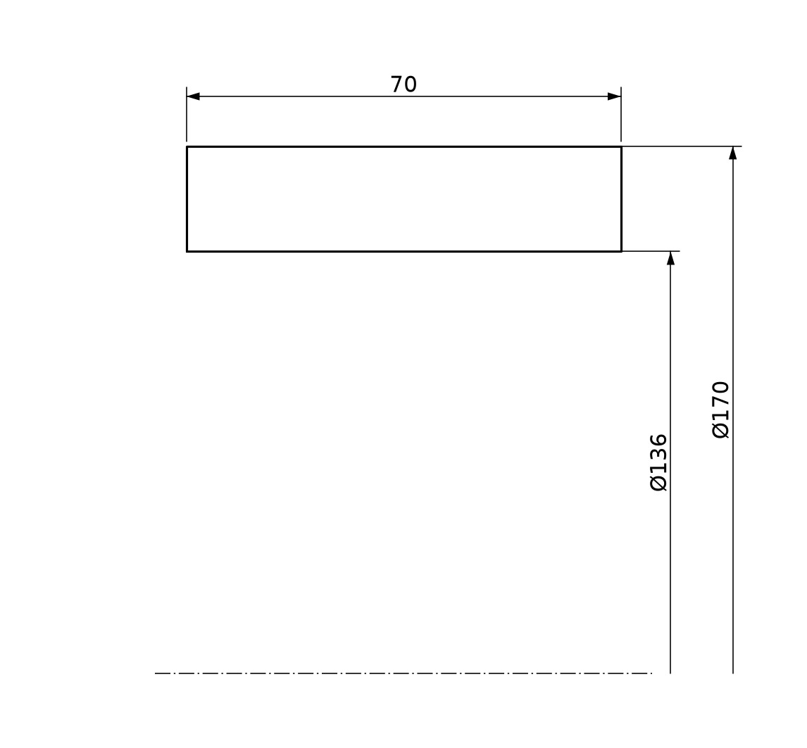

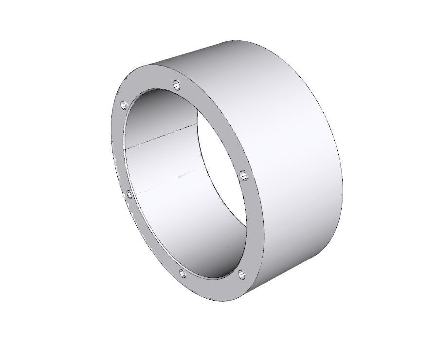

**Hinweise**

- Die Lage 30° zu FRONT ist frei gewählt. In der Baugruppe richtest du die Gewinde über eine Abhängigkeit „fluchtend“ auf die Bohrungen von Deckel und Abtriebsnabe aus.

## Pos. 4 – Deckel

Werkstoff: **EN-GJS-700-2** · Vorlage: `mmns_part_solid_abs` · Grundlage: Zeichnung 14.2.5.5

| Nr | Creo-KE | Ebene / Referenz | Eingaben / Maße |
|---|---|---|---|
| 1 | Drehen (Grundkörper) | Skizze auf FRONT, Achse = Mittellinie | Skizze 1: Flansch Ø170 × 12, Zentrierring Ø136 / Ø125 bis 19, Lagerrohr außen mit 5° Aushebeschräge (Ø84 bei 29), Lagersitz Ø75 (13 bis 29), Schulter Ø70 mit Bogen R2 (in der Skizze), Bohrung Ø46, Filzringnut Ø58: unten 4 breit, Flanken 7°. Winkel 360°. |
| 2 | Rundung | 2 Innenkanten bei x = 12 (am Ø125 und am Lagerrohr) | R5 |
| 3 | Rundung | Außenkante Ø170 bei x = 0 | R2 |
| 4 | Fase | Kante Ø136 bei x = 19 | 1,5 × 45° |
| 5 | Bohrung (Senkung) | Flanschfläche x = 0, Lochkreis Ø150, 0° zu FRONT | Ø9 durchgehend, Senkung Ø15 × 8,6 tief |
| 6 | Muster | Typ Achse, Deckelachse | 6 Stück, 60° |

**Kontrolle:** Analyse → Masseneigenschaften → Volumen = **276.618 mm³**

*Skizze 1 – Drehen (KE 1)*

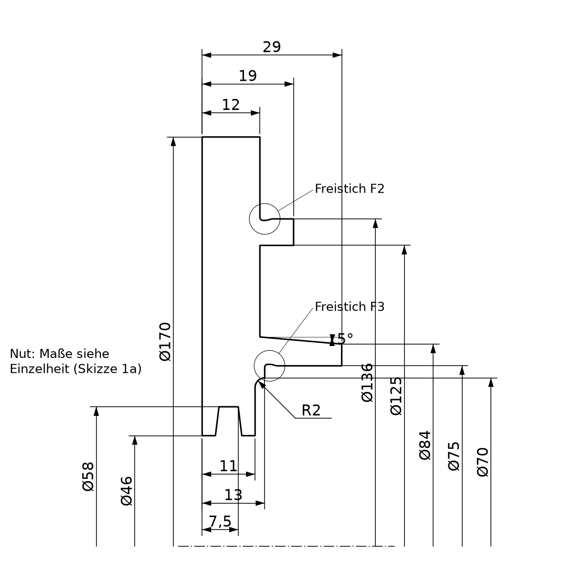

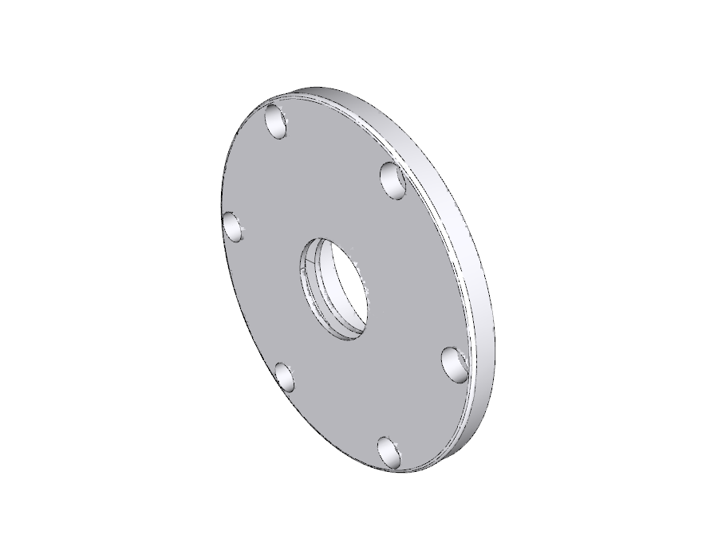

**Hinweise**

- Die Filzringnut und der Bogen R2 (Einzelheit Z) gehören in die Drehskizze. Eine eigene Rundung R2 schlägt dort fehl.
- Ø84 am Lagerrohr fehlt im Buch. Ich habe es aus dem Modell ergänzt.

## Pos. 5.1 – Gewicht (Teil des Fliehgewichts)

Werkstoff: **EN-GJS-700-2** · Vorlage: `mmns_part_solid_abs` · Grundlage: Zeichnung 14.2.5.6 + STEP-Modell

| Nr | Creo-KE | Ebene / Referenz | Eingaben / Maße |
|---|---|---|---|
| 1 | Extrudieren (Schuh) | Skizze auf FRONT (= Mittelebene der Nut), Ursprung = Kupplungsachse | Skizze 1: Schuh innen R51,5, außen R60, Enden R4,25 (Mittelpunkte auf R55,75 bei ±52,13° zur Senkrechten), Belagsitz R62 über 102° (±51°). Tiefe symmetrisch 54. |
| 2 | Ebene DTM1 | parallel zu FRONT | Versatz 9 |
| 3 | Extrudieren (Arm) | Skizze auf DTM1 | Skizze 2: Bogenstück innen R43, außen R60, Enden R8,5 (Mittelpunkte auf R51,5 bei ±67,5°, zusammen 135°). Tiefe 9 (von FRONT weg, bis 18). |
| 4 | Extrudieren, Material entfernen (Planfläche außen) | Armfläche bei 18 | 2 Kreise R9, konzentrisch zu den R8,5-Bögen, Tiefe 1 |
| 5 | Extrudieren, Material entfernen (Planfläche innen) | Armfläche bei 9 | 2 Kreise R9, Tiefe 1. So entstehen Nutbreite 20 und Breite außen 34. |
| 6 | Spiegeln | KE 3 bis 5 an FRONT | zweiter Arm |
| 7 | Bohrung | koaxial zur Achse der R8,5-Bögen | Ø8H9, Tiefe „Durch alle“, beide Augen |

**Kontrolle:** Analyse → Masseneigenschaften → Volumen = **82.713 mm³**

*Skizze 1 – Schuh auf FRONT (KE 1)*

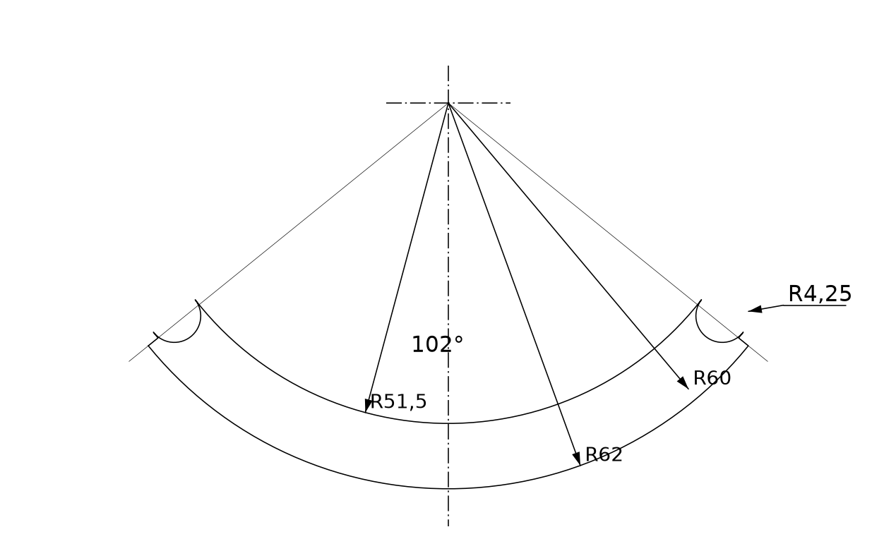

*Skizze 2 – Arm auf DTM1 (KE 3)*

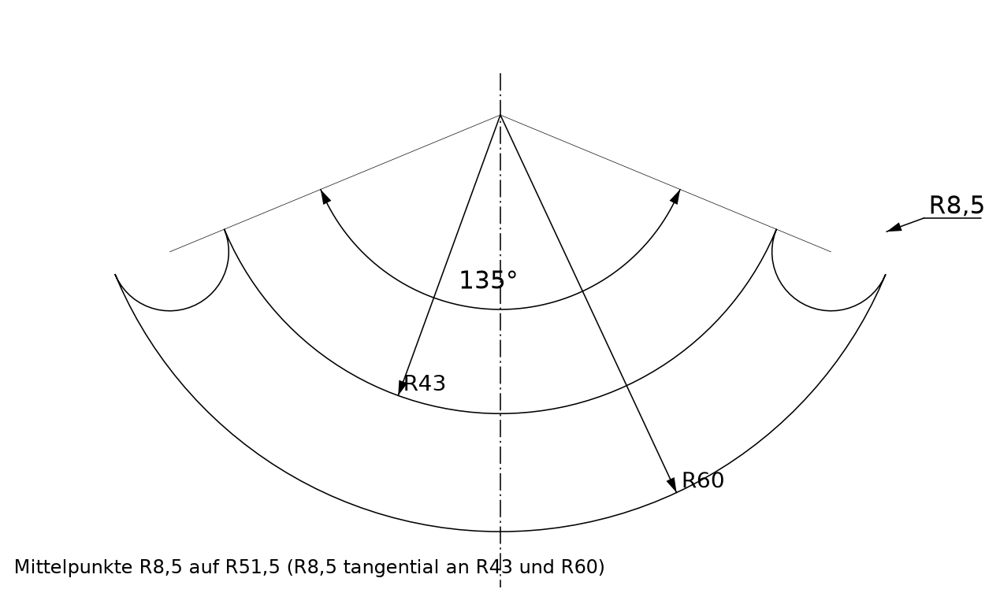

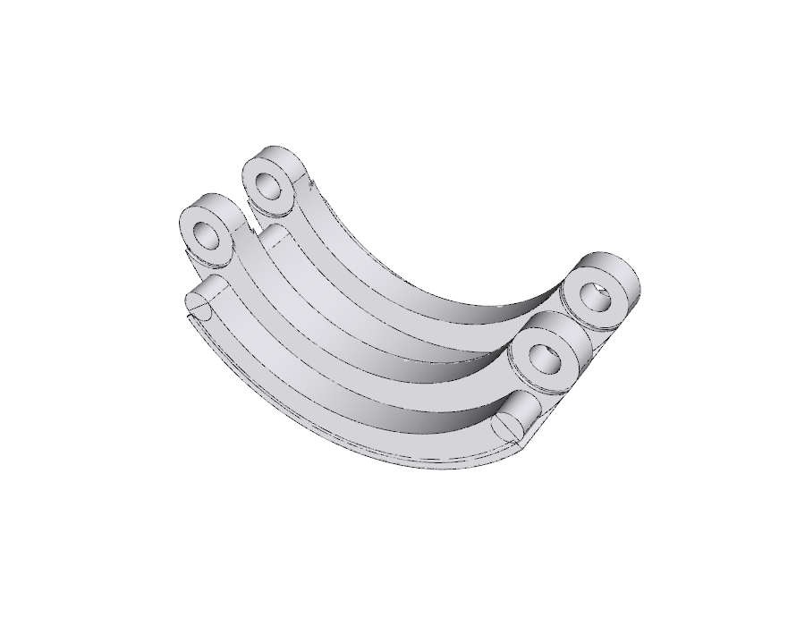

**Hinweise**

- Die Bohrungen sitzen konzentrisch zu den Augen, damit sind sie 95,16 auseinander. Im Buch steht 95,77, das passt nicht zu R51,5 und 135°.
- Buch R52 / 113° ↔ STEP R51,5 / 112,5°: gebaut ist nach dem STEP-Modell.

## Pos. 5.2 – Belag (Teil des Fliehgewichts)

Werkstoff: **Reibbelag** · Vorlage: `mmns_part_solid_abs` · Grundlage: Zeichnung 14.2.5.6 + STEP-Modell

| Nr | Creo-KE | Ebene / Referenz | Eingaben / Maße |
|---|---|---|---|
| 1 | Extrudieren | Skizze auf FRONT, Ursprung = Kupplungsachse | Skizze 1: Ringsektor innen R62, außen R65, Winkel 92°, symmetrisch zur Senkrechten. Tiefe symmetrisch 54. |
| 2 | Fase (Einlaufschräge) | 2 äußere Endkanten (R65) | Typ D1 × D2: 1,5 radial × 5 am Umfang |

**Kontrolle:** Analyse → Masseneigenschaften → Volumen = **16.096 mm³**

*Skizze 1 – Belag (KE 1)*

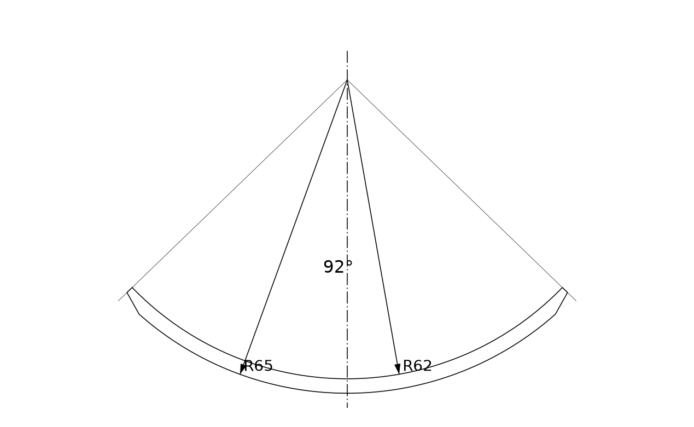

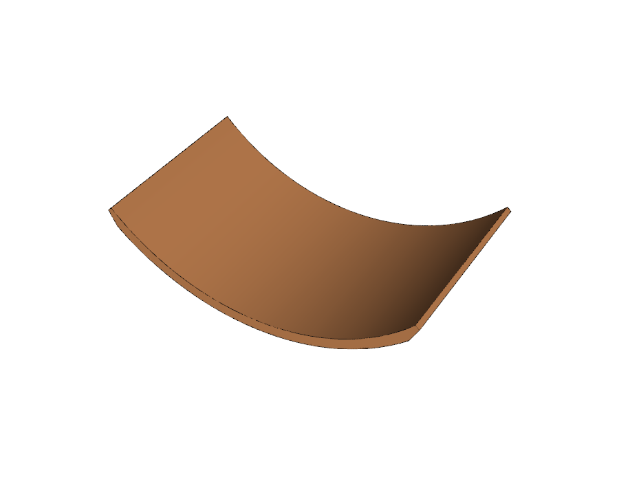

**Hinweise**

- Pos. 5 ist eine Unterbaugruppe: Datei → Neu → Baugruppe (mmns_asm_design_abs). 5.1 mit „Standard“ einbauen, 5.2 mit Achse ↔ Achse der Bögen, FRONT ↔ FRONT und RIGHT ↔ RIGHT.
- In der Kupplung wird Pos. 5 zweimal eingebaut.

## Pos. 6 – Scheibe

Werkstoff: **S235JR** · Vorlage: `mmns_part_solid_abs` · Grundlage: Zeichnung 14.2.5.7

| Nr | Creo-KE | Ebene / Referenz | Eingaben / Maße |
|---|---|---|---|
| 1 | Extrudieren | Skizze auf FRONT | Skizze 1: Kreis Ø16 und Kreis Ø9 (beide im Ursprung). Tiefe 1,5. |

**Kontrolle:** Analyse → Masseneigenschaften → Volumen = **206 mm³**

*Skizze 1 – Ring (KE 1)*

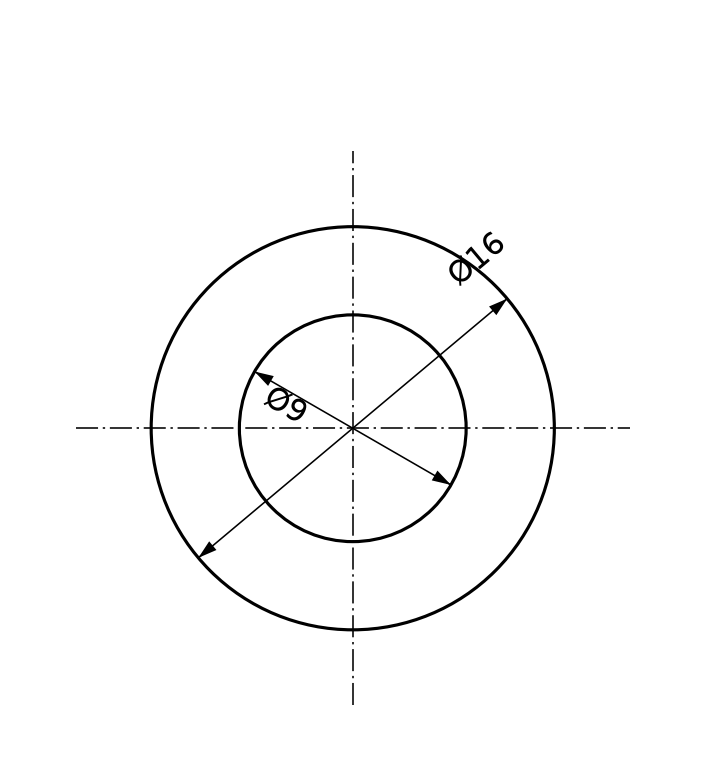

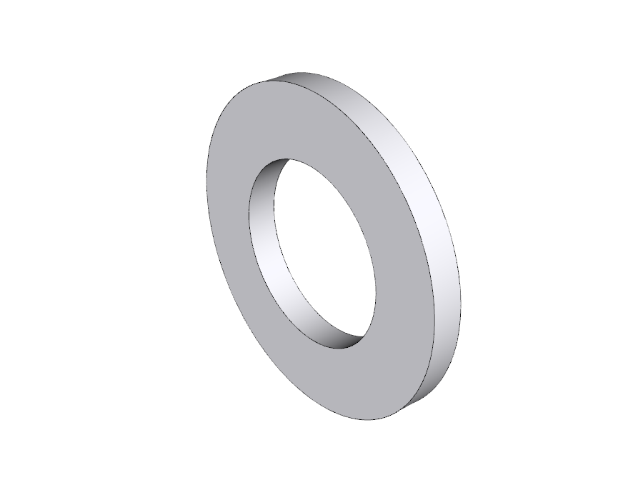

**Hinweise**

- Das einfachste Teil. Gut geeignet, um den Ablauf mit Vorlage, Skizze und Volumen einmal zu üben.

## Pos. 7 – Zugfeder

Werkstoff: **Federstahl (46Si7 laut Zeichnung)** · Vorlage: `mmns_part_solid_abs` · Grundlage: Zeichnung 14.2.5.8

| Nr | Creo-KE | Ebene / Referenz | Eingaben / Maße |
|---|---|---|---|
| 1 | Schraubenförmiges Zug-KE (Federkörper) | Profilskizze auf FRONT: Mittellinie = Federachse | Skizze 1: Profillinie parallel zur Achse im Abstand 3,45 (mittlerer Ø6,9), Länge 14,3. Steigung 1,1, rechtsgängig. Querschnitt: Kreis Ø1,1 am Profilanfang. Ergibt 13 anliegende Windungen. |
| 2 | Zug-KE (Öse 1) | Leitkurve skizziert auf FRONT | Skizze 2: Kreisbogen R3,45, Mittelpunkt auf der Achse 3 mm vor dem Drahtende, Öffnung 2 mm. Querschnitt Kreis Ø1,1. |
| 3 | Ebene DTM1 | parallel zu RIGHT | genau in der Mitte des Federkörpers |
| 4 | Spiegeln | Öse aus KE 2 an DTM1 | Öse 2 |

**Kontrolle:** Analyse → Masseneigenschaften → Volumen = **305 mm³**

*Skizze 1 – Profil Zug-KE (KE 1)*

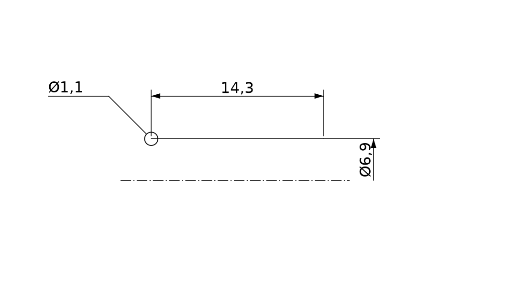

*Skizze 2 – Öse (KE 2)*

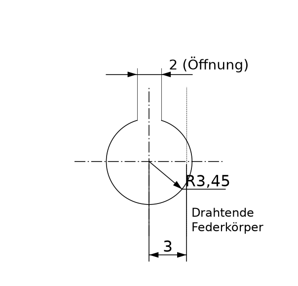

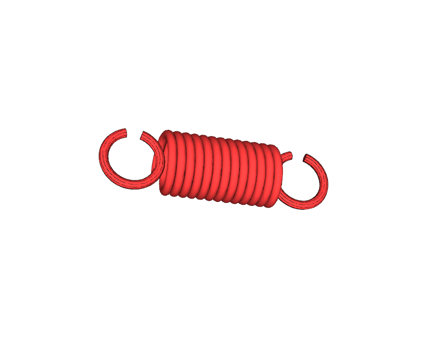

**Hinweise**

- Gebaut ist die Feder ungespannt nach Zeichnung. In der Baugruppe ist sie gespannt (Ösenabstand 38,8). Dafür die gespannte STEP-Datei nehmen oder die Steigung als flexibles Maß freigeben.
- Buchfehler: Die Öse hat außen Ø8, innen also nur Ø5,8. Der Einstich im Stift hat aber Ø6,8, deshalb passt die Feder nicht. Bei der Lehrkraft nachfragen.
- Der Übergang von der Windung zur Öse ist hier nur angenähert. Für Zeichnung und Baugruppe reicht das.

## Pos. 9 – Zylinderstift

Werkstoff: **C45E** · Vorlage: `mmns_part_solid_abs` · Grundlage: Zeichnung 14.2.5.9

| Nr | Creo-KE | Ebene / Referenz | Eingaben / Maße |
|---|---|---|---|
| 1 | Drehen (Grundkörper) | Skizze auf FRONT, Achse = Mittellinie | Skizze 1: Rechteck Ø8 × 50. Winkel 360°. |
| 2 | Drehen, Material entfernen (Nut) | Skizze auf FRONT | Skizze 2: Rechteck 0,94 breit, 7 vom linken Ende, bis Ø7 (für die Sicherungsscheibe) |
| 3 | Drehen, Material entfernen (Einstich) | Skizze auf FRONT | Skizze 3: Halbkreis R0,6, Mittelpunkt auf der Mantellinie, 3 vom Ende (für die Federöse) |
| 4 | Ebene DTM1 | parallel zu RIGHT | Versatz 25 = Stiftmitte |
| 5 | Spiegeln | KE 2 und 3 an DTM1 | ergibt Nut und Einstich auf der anderen Seite (Nutabstand 36) |

**Kontrolle:** Analyse → Masseneigenschaften → Volumen = **2.465 mm³**

*Skizze 1 – Drehen (KE 1)*

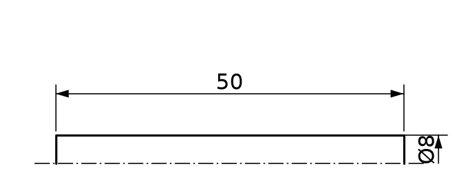

*Skizze 2 – Nut (KE 2)*

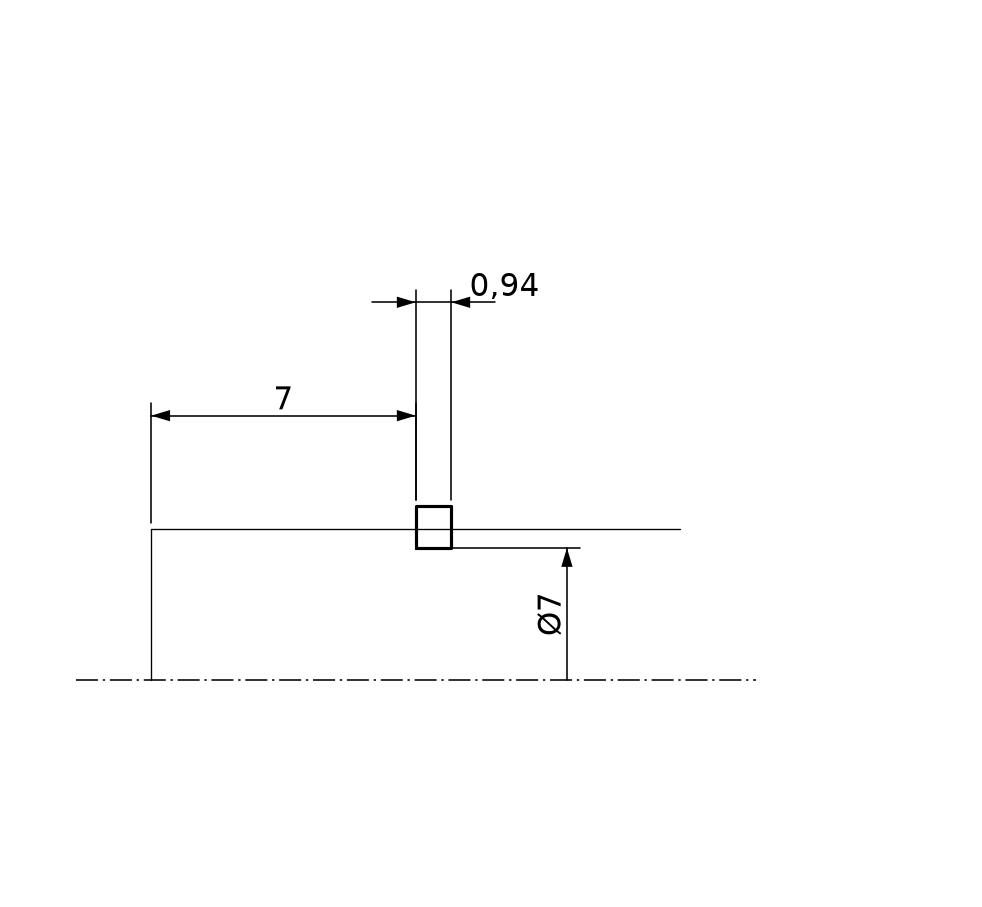

*Skizze 3 – Einstich (KE 3)*

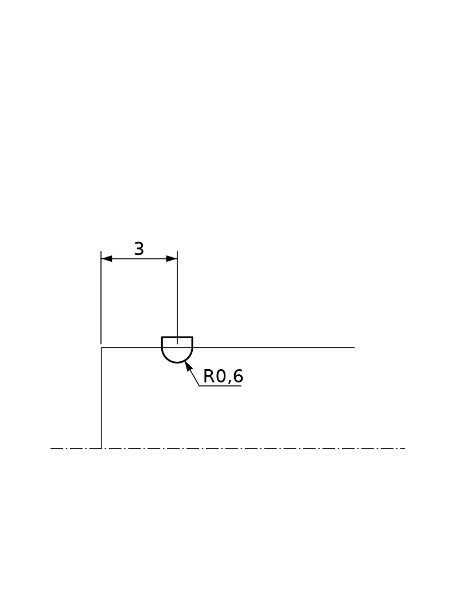

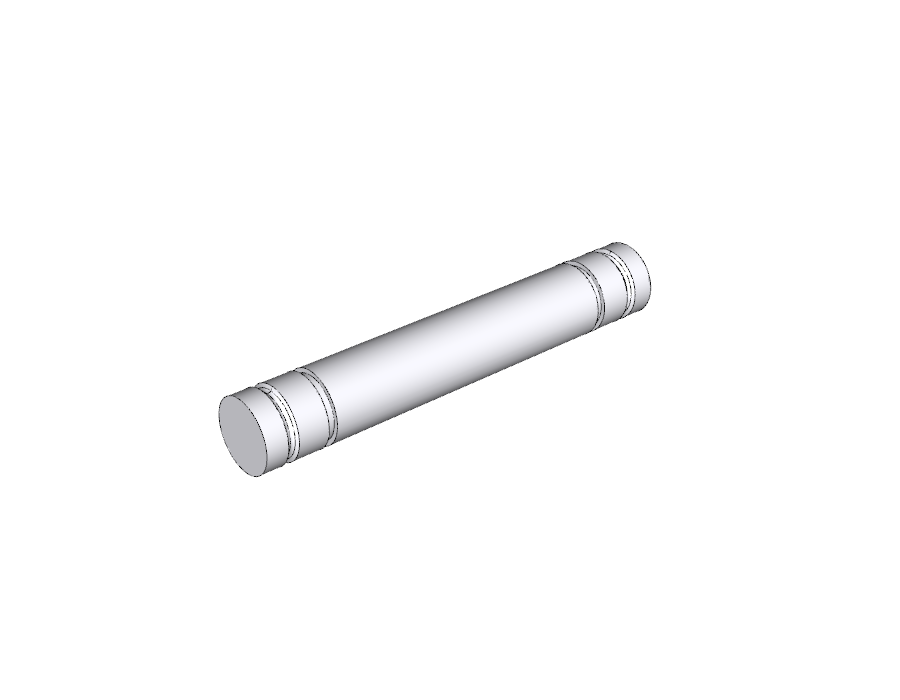

**Hinweise**

- Durch das Spiegeln bleibt der Nutabstand 36 +0,3 automatisch symmetrisch.

## Pos. 12 – Filzring DIN 5419 – 45

Werkstoff: **Filz** · Vorlage: `mmns_part_solid_abs` · Grundlage: Norm DIN 5419 / Nut im Deckel

| Nr | Creo-KE | Ebene / Referenz | Eingaben / Maße |
|---|---|---|---|
| 1 | Drehen | Skizze auf FRONT, Achse = Mittellinie | Skizze 1: Trapez innen Ø45, außen Ø58, außen 4 breit, Flanken je 7° (genau wie die Nut im Deckel). Winkel 360°. |

**Kontrolle:** Analyse → Masseneigenschaften → Volumen = **5.010 mm³**

*Skizze 1 – Drehen (KE 1)*

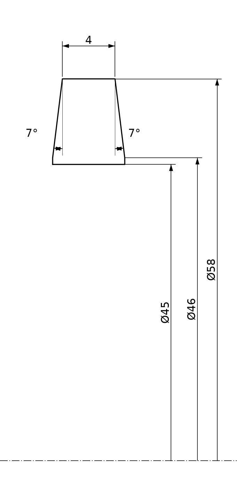

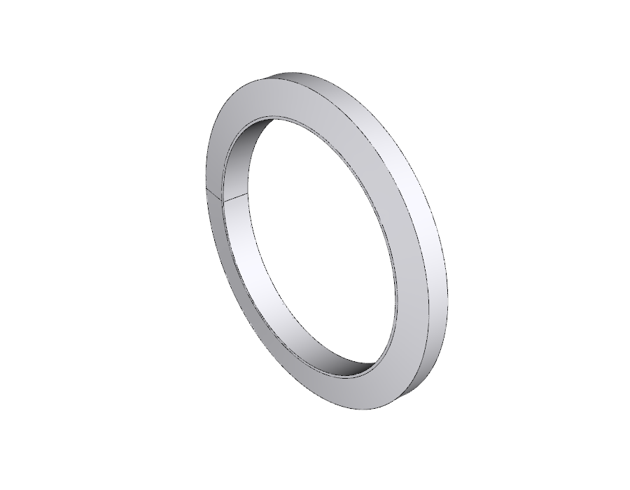

**Hinweise**

- Der Filzring ist ein Normteil. Im Querschnitt entspricht er genau der Deckelnut, deshalb kannst du die Maße aus Pos. 4 übernehmen.

## Normteile (nicht selbst modellieren)

| Pos. | Teil | So kommt es in Creo |
|---|---|---|
| 8 | Sicherungsscheibe DIN 6799 – 7 | Normteil. STEP aus Teil_A/CAD/Einzelteile_alle/ einbauen oder vom Hersteller bzw. aus TraceParts laden. Selbst modellieren ist nicht verlangt. |
| 10 | Zylinderschraube ISO 4762 – M8 × 20 | In der Baugruppe: Register „Intelligent Fastener“ → Schraube ISO 4762 M8 × 20 auf die Senkbohrung setzen. Creo setzt sie dann auf alle Musterbohrungen. Ohne Lizenz die STEP-Datei verwenden. |
| 11 | Rillenkugellager 6009-2Z | Herstellermodell laden (z. B. SKF oder Schaeffler, STEP) oder die STEP-Datei aus dem Repo. Für die Baugruppe reichen die Hauptmaße d 45 / D 75 / B 16. |

## Skripte (zur Kontrolle)

| Datei | Zweck |
|---|---|
| `Skripte/replay.py` | baut jedes Teil genau in der KE-Reihenfolge dieser Anleitung nach (CadQuery). Daraus stammen Sollvolumen und 3D-Bilder. |
| `Skripte/skizzen.py`, `Skripte/sk_all.py` | zeichnen die bemaßten Skizzenbilder |
| `Skripte/mb_daten.py`, `Skripte/doc_modellbaum.py` | KE-Tabellen und Erzeugung von PDF und README |
