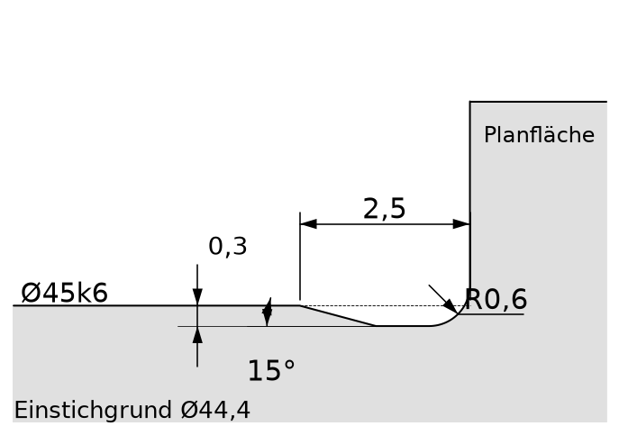
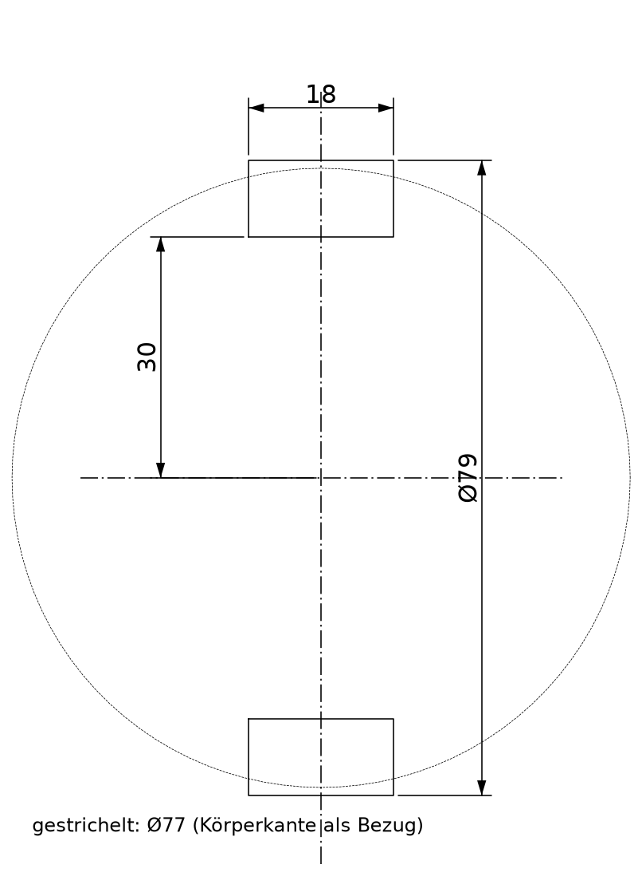
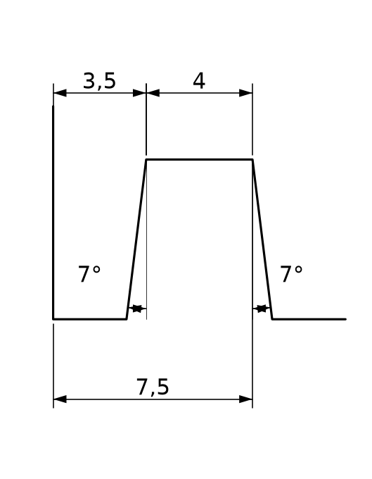

# Fliehkraftkupplung – Schritt für Schritt in Creo 12

Ausführliche Fassung zur Kurzanleitung `Modellbaum_Einzelteile.pdf`. Nach jedem KE steht das Volumen, das du haben musst.

## Neues Teil anlegen

- Datei → Neu → Typ „Teil“, Untertyp „Volumenkörper“ → Name eingeben (z. B. POS01_ANTRIEBSNABE).
- Haken bei „Standardvorlage verwenden“ entfernen → OK → Vorlage mmns_part_solid_abs → OK.
- Im Modellbaum stehen jetzt die Ebenen RECHTS, OBEN, VORNE, die Achsen A_X, A_Y, A_Z und das Koordinatensystem BASIS.

## Grundmuster „Drehen“ (Pos. 1, 2, 3, 4, 9, 12)

- Register Modell → Drehen → Register Platzierung → Definieren.
- Skizzierebene: VORNE, Referenz: RECHTS, Ausrichtung: Rechts → Skizzieren → Knopf Skizzieransicht.
- Waagrechte lila Linie = OBEN (wird die Drehachse), senkrechte lila Linie = RECHTS (linke Stirnfläche, x = 0).
- Gruppe Bezug → Mittellinie: zweimal auf die waagrechte lila Linie klicken. Das ist die Drehachse (Geometrie-Mittellinie).
- Gruppe Skizze → Linie: die Kontur Punkt für Punkt als geschlossenen Zug zeichnen (Tabelle beim Teil). Am Ende wieder auf den Startpunkt klicken, MMT.
- Die linke Stirnfläche mit „Zusammenfallend“ auf die senkrechte lila Linie (RECHTS) legen.
- Bemaßen (siehe unten), dann ✔ → Winkel 360° → ✔.

## Bemaßen im Skizzierer

- Durchmesser: Linie (oder Punkt) → Mittellinie → nochmal dieselbe Linie → MMT.
- Länge/Abstand: Element 1 → Element 2 → MMT.
- Radius: Bogen einmal anklicken → MMT. Durchmesser eines Kreises: Doppelklick auf den Kreis → MMT.
- Winkel: Linie 1 → Linie 2 → MMT im spitzen Winkel.
- Wert ändern: Doppelklick auf das Maß → Wert → Enter. Viele Werte: mit Strg markieren → Ändern → Haken „Neu generieren“ weg → Werte → OK.
- Fertig ist die Skizze erst, wenn KEIN hellblaues (schwaches) Maß mehr da ist und keine roten Endpunkte.

## Kontrolle nach jedem KE

- Register Analyse → Masseneigenschaften → Volumen ablesen und mit dem Wert im grünen Kasten (✔) vergleichen (±0,5 %).
- Jedes KE im Modellbaum umbenennen (Rechtsklick → Umbenennen), z. B. „Arme“, „Passfedernut“.
- Die Namen der Menüs können in deiner Creo-Version minimal anders heißen. Wenn du einen Knopf nicht findest: Maus darüber halten und den Tooltip lesen.

## Freistich DIN 509 – E 0,6 × 0,3 (in der Drehskizze)

1. Linie des Lagersitzes 2,5 vor der Planfläche enden lassen (Maß 2,5 zur Planfläche).
2. Linie unter 15° zur Achse bis zum Einstichgrund (Wellen: kleiner Ø, Bohrungen: größerer Ø).
3. Einstichgrund waagrecht bis an die Planfläche, als Durchmesser bemaßen.
4. Gruppe Skizze → Verrundung → „Kreisförmig getrimmt“ → Einstichgrund → Planfläche → R0,6.

## Pos. 1 – Antriebsnabe

Dateiname `POS01_ANTRIEBSNABE` · Werkstoff EN-GJS-700-2 · Vorlage `mmns_part_solid_abs`

| Punkt | x | Ø | Hinweis |
|---|---|---|---|
| 1 | 0 | Ø30 | Start an RECHTS |
| 2 | 0 | Ø45 |  |
| 3 | 29 | Ø45 | hier Freistich F1 |
| 4 | 29 | Ø51 | Stufe |
| 5 | 31 | Ø55 | Bogen R2 von 4 nach 5, tangential an die Linie 5–6 |
| 6 | 31 | Ø77 |  |
| 7 | 63 | Ø77 |  |
| 8 | 63 | Ø55 |  |
| 9 | 65 | Ø51 | Bogen R2, tangential an 7–8 |
| 10 | 65 | Ø45 | hier Freistich F1 (gespiegelt) |
| 11 | 81 | Ø45 |  |
| 12 | 81 | Ø30 | zurück zu 1 |

### KE 1 – Drehen (Grundkörper)

- Grundmuster „Drehen“ (Seite 2). Kontur nach der Tabelle oben.
- Maße: 81, 29, 31, 18 (von rechts bis 63), 16 (von rechts bis 65), Ø30, Ø45 (2×), Ø51 (2×), Ø77, R2 (2×).
- Freistiche F1 an beiden Lagersitzen: Grund Ø44,4 (Schritte siehe Freistich-Kasten).

✅ **Volumen nach diesem KE: 171.635 mm³**

### KE 2 – Rundung R2 (Außenkanten Ø77)

- Modell → Rundung → Wert 2.
- LMT auf die Kreiskante Ø77/linke Planfläche, Strg + LMT auf die Kante Ø77/rechte Planfläche → ✔.

✅ **Volumen nach diesem KE: 171.225 mm³**

### KE 3 – Ebene DTM1

- Modell → Ebene → im Modellbaum RECHTS anklicken → Versatz 47 (Pfeil ins Teil) → OK.

### KE 4 – Extrudieren: Arme

- Modell → Extrudieren → Platzierung → Definieren → Skizzierebene DTM1, Referenz OBEN, Ausrichtung Oben → Skizzieren → Skizzieransicht.
- Gruppe Skizze → Mittellinie: eine auf die senkrechte, eine auf die waagrechte lila Linie.
- Oberer Arm: Rechteck zeichnen → obere Linie löschen → Bogen (3-Punkt/Tangente am Ende) von Ecke zu Ecke, bis an beiden Seiten „T“ erscheint.
- Bedingung Symmetrisch: senkrechte Mittellinie → linke untere Ecke → rechte untere Ecke.
- Maße: 18 (Breite), 30 (waagrechte Mittellinie → Unterkante), 52 (waagrechte Mittellinie → Bogenmittelpunkt). R9 ergibt sich von selbst.
- Alle 4 Elemente mit Strg markieren → Editieren → Spiegeln → waagrechte Mittellinie.
- ✔ → Tiefe „Symmetrisch“ 17 → ✔.
- ⚠ Keine Rundungen unten am Arm in die Skizze zeichnen – die R9 kommt als eigenes KE.

✅ **Volumen nach diesem KE: 184.029 mm³**

### KE 5 – Rundung R9

- Rundung → 9 → die 4 geraden Kanten, an denen die 18 mm auseinanderliegenden Armseiten auf den Ø77 treffen (Strg) → ✔.
- ⚠ Unbedingt VOR dem Fuß, sonst schlägt die Rundung fehl.

✅ **Volumen nach diesem KE: 184.532 mm³**

### KE 6 – Extrudieren: Fuß

- Skizze wieder auf DTM1 (Referenz OBEN, Oben). Mittellinien wie bei KE 4.
- Rechteck symmetrisch zur senkrechten Mittellinie: 18 breit, Unterkante 30, Oberkante 39,5 (= Ø79) über der Mitte. Spiegeln.
- ✔ → Tiefe Symmetrisch 20 → ✔.

✅ **Volumen nach diesem KE: 184.678 mm³**

### KE 7 – Bohrungen Ø8H8

- Extrudieren → Skizze auf DTM1 → Kreis Ø8, Mittelpunkt auf der senkrechten Mittellinie, 52 über der Mitte → Spiegeln.
- ✔ → Tiefe Symmetrisch 20 → Knopf „Material entfernen“ → ✔.

✅ **Volumen nach diesem KE: 182.969 mm³**

### KE 8 – Passfedernut

- Extrudieren → Skizze auf RECHTS (Referenz OBEN, Oben) → Arme stehen oben/unten.
- Rechteck quer zu den Armen: 8 hoch, symmetrisch zur waagrechten Mittellinie, von der Mitte bis 18,3 zur Seite.
- ✔ → Tiefe „Durch alle“ (Pfeil ins Teil) → Material entfernen → ✔. Kontrolle: 15 + 18,3 = 33,3.

✅ **Volumen nach diesem KE: 180.714 mm³**

## Pos. 2 – Abtriebsnabe

Dateiname `POS02_ABTRIEBSNABE` · Werkstoff EN-GJS-700-2 (Maße aus STEP) · Vorlage `mmns_part_solid_abs`

| Punkt | x | Ø | Hinweis |
|---|---|---|---|
| 1 | 0 | Ø30 | Start an RECHTS |
| 2 | 0 | Ø50 |  |
| 3 | 43 | Ø50 |  |
| 4 | 43 | Ø170 |  |
| 5 | 55 | Ø170 |  |
| 6 | 55 | Ø136 | Freistich F2 |
| 7 | 62 | Ø136 |  |
| 8 | 62 | Ø125 |  |
| 9 | 55 | Ø125 |  |
| 10 | 55 | ≈Ø88,2 | nicht bemaßen, ergibt sich aus 5° |
| 11 | 72 | Ø85,3 | schräg, 5° |
| 12 | 72 | Ø75 |  |
| 13 | 56 | Ø75 | Freistich F3 |
| 14 | 56 | Ø70 |  |
| 15 | 54 | Ø66 | Bogen R2, tangential an 15–16 |
| 16 | 54 | Ø30 | zurück zu 1 |

### KE 1 – Drehen

- Grundmuster „Drehen“. Kontur nach Tabelle. Maße: 43, 55, 62, 72, 54, 56, Ø30, Ø50, Ø170, Ø136, Ø125, Ø85,3, Ø75, Ø70, 5°, R2.
- Freistiche F2 (Grund Ø135,4) und F3 (Grund Ø75,6).

✅ **Volumen nach diesem KE: 356.379 mm³**

### KE 2 – Rundung R10

- Innenecke Nabe Ø50 / Flansch bei 43 → R10.

✅ **Volumen nach diesem KE: 360.051 mm³**

### KE 3 – Rundung R5

- Die 2 Innenkanten bei 55 (am Ø125 und am Lagerrohr) → R5.

✅ **Volumen nach diesem KE: 363.355 mm³**

### KE 4 – Rundung R2

- Außenkante Nabe bei 0 (Ø50) und Flanschkante Ø170 bei 43 → R2.

✅ **Volumen nach diesem KE: 362.766 mm³**

### KE 5 – Fase 1,5 × 45°

- Modell → Fase (Kantenfase) → D = 1,5 → Kante Ø136 bei 62 → ✔.

✅ **Volumen nach diesem KE: 362.289 mm³**

### KE 6 – Passfedernut

- Extrudieren → Skizze auf RECHTS → Rechteck 8 breit, symmetrisch zur Mitte, bis 18,3 → Durch alle → Material entfernen.

✅ **Volumen nach diesem KE: 360.786 mm³**

### KE 7 – Bohrung mit Senkung (1 Stück)

- Modell → Bohrung. Platzierung: Flanschfläche bei 43 anklicken, Typ „Durchmesser“, Versatzreferenzen: Achse A_X und Ebene VORNE (Winkel 0°), Durchmesser 150.
- Bohrung Ø9 „Durch alle“ mit Senkung Ø15, Tiefe 8,6 (Standardbohrung ISO M8 mit Senkung, oder zwei einfache Bohrungen Ø15 × 8,6 und Ø9 durch → zu einer Gruppe zusammenfassen).

✅ **Volumen nach diesem KE: 359.050 mm³**

### KE 8 – Muster

- Bohrung (oder Gruppe) im Modellbaum anklicken → Muster → Typ Achse → A_X → 6 Stück, 60° → ✔.

✅ **Volumen nach diesem KE: 350.370 mm³**

## Pos. 3 – Gehäuse

Dateiname `POS03_GEHAEUSE` · Werkstoff E295 · Vorlage `mmns_part_solid_abs`

| Punkt | x | Ø | Hinweis |
|---|---|---|---|
| 1 | 0 | Ø136 | Start an RECHTS |
| 2 | 70 | Ø136 |  |
| 3 | 70 | Ø170 |  |
| 4 | 0 | Ø170 | zurück zu 1 |

### KE 1 – Drehen

- Grundmuster „Drehen“, Rechteck nach Tabelle. Maße: 70, Ø136, Ø170.

✅ **Volumen nach diesem KE: 571.990 mm³**

### KE 2 – Fase 1 × 45°

- Fase → D = 1 → beide Innenkanten Ø136 (Strg) → ✔.

✅ **Volumen nach diesem KE: 571.560 mm³**

### KE 3 – Gewindebohrung M8 (1 Stück)

- Modell → Bohrung → Standardbohrung (Gewinde) → ISO, M8x1.25.
- Platzierung: Stirnfläche bei 0, Typ „Durchmesser“, Achse A_X + Ebene VORNE, Winkel 30°, Durchmesser 150.
- Bohrtiefe 26 (Kernloch Ø6,8), Gewindetiefe 20, Spitzenwinkel 118° → ✔.

✅ **Volumen nach diesem KE: 570.591 mm³**

### KE 4 – Muster

- Bohrung anklicken → Muster → Typ Achse → A_X → 6 Stück, 60° → ✔.

✅ **Volumen nach diesem KE: 565.747 mm³**

### KE 5 – Ebene DTM1

- Ebene → RECHTS → Versatz 35 (Gehäusemitte).

### KE 6 – Spiegeln

- Muster im Modellbaum anklicken → Modell → Spiegeln → DTM1 → ✔. Jetzt 6 Gewinde auf jeder Seite.

✅ **Volumen nach diesem KE: 559.933 mm³**

## Pos. 4 – Deckel

Dateiname `POS04_DECKEL` · Werkstoff EN-GJS-700-2 · Vorlage `mmns_part_solid_abs`

| Punkt | x | Ø | Hinweis |
|---|---|---|---|
| 1 | 0 | Ø46 | Start an RECHTS |
| 2 | 0 | Ø170 |  |
| 3 | 12 | Ø170 |  |
| 4 | 12 | Ø136 | Freistich F2 |
| 5 | 19 | Ø136 |  |
| 6 | 19 | Ø125 |  |
| 7 | 12 | Ø125 |  |
| 8 | 12 | ≈Ø87 | nicht bemaßen, ergibt sich aus 5° |
| 9 | 29 | Ø84 | schräg, 5° |
| 10 | 29 | Ø75 |  |
| 11 | 13 | Ø75 | Freistich F3 |
| 12 | 13 | Ø70 |  |
| 13 | 11 | Ø66 | Bogen R2, tangential an 13–14 |
| 14 | 11 | Ø46 |  |
| 15 | 8,24 | Ø46 | Filzringnut: |
| 16 | 7,5 | Ø58 | Flanke 7° |
| 17 | 3,5 | Ø58 | Grund 4 breit |
| 18 | 2,76 | Ø46 | Flanke 7°, zurück zu 1 |

### KE 1 – Drehen

- Grundmuster „Drehen“, Kontur nach Tabelle. Maße: 12, 19, 29, 13, 11, Ø170, Ø136, Ø125, Ø84, Ø75, Ø70, Ø46, 5°, R2.
- Filzringnut: 3,5 und 7,5 (von RECHTS), Ø58, Flanken je 7° (Skizze 1a). Freistiche F2 (Grund Ø135,4) und F3 (Grund Ø75,6).

✅ **Volumen nach diesem KE: 284.345 mm³**

### KE 2 – Rundung R5

- 2 Innenkanten bei 12 (am Ø125 und am Lagerrohr) → R5.

✅ **Volumen nach diesem KE: 287.633 mm³**

### KE 3 – Rundung R2

- Außenkante Ø170 bei 0 → R2.

✅ **Volumen nach diesem KE: 287.177 mm³**

### KE 4 – Fase 1,5 × 45°

- Kante Ø136 bei 19 → D = 1,5.

✅ **Volumen nach diesem KE: 286.700 mm³**

### KE 5 – Bohrung mit Senkung (1 Stück)

- Wie Pos. 2, KE 7, aber Platzierung auf der Flanschfläche bei 0. Ø9 durch, Senkung Ø15 × 8,6, Durchmesser 150, Winkel 0° zu VORNE.

✅ **Volumen nach diesem KE: 284.964 mm³**

### KE 6 – Muster

- Muster → Typ Achse → A_X → 6 Stück, 60°.

✅ **Volumen nach diesem KE: 276.284 mm³**

## Pos. 5.1 – Gewicht

Dateiname `POS05-1_GEWICHT` · Werkstoff EN-GJS-700-2 · Vorlage `mmns_part_solid_abs`

### Vorbereitung

- Der Ursprung (Kreuzung der lila Linien) ist die Kupplungsachse. Das Gewicht liegt UNTER dem Ursprung.
- Winkel werden von der senkrechten Linie nach unten gemessen.

### KE 1 – Extrudieren: Schuh (Bogen-Langloch)

- Extrudieren → Skizze auf VORNE (Referenz RECHTS, Rechts).
- Gruppe Skizze → Mittellinie: eine senkrecht durch den Ursprung, zwei schräge vom Ursprung nach unten, symmetrisch, Winkel zwischen ihnen 104,26°.
- Bogen (Mittelpunkt und Enden): Mittelpunkt im Ursprung, R51,5, von schräger Linie zu schräger Linie. Genauso R60.
- An beiden Enden je einen Bogen (3-Punkt/Tangente) von R51,5 zu R60 nach außen → wird automatisch R4,25.
- ✔ → Tiefe Symmetrisch 54 → ✔.

✅ **Volumen nach diesem KE: 49.628 mm³**

### KE 2 – Extrudieren: Belagsitz R62

- Neue Skizze auf VORNE: zwei Mittellinien symmetrisch, Winkel 102°.
- Bogen R59 und Bogen R62 (Mittelpunkt im Ursprung), dazu zwei kurze Linien auf den schrägen Mittellinien → geschlossener Ringabschnitt.
- ✔ → Symmetrisch 54 → ✔. (R59 liegt im Schuh, damit beide verschmelzen.)

✅ **Volumen nach diesem KE: 61.357 mm³**

### KE 3 – Ebene DTM1

- Ebene → VORNE → Versatz 9.

### KE 4 – Extrudieren: Arm

- Skizze auf DTM1 (Referenz RECHTS). Mittellinien symmetrisch mit 135° Winkel.
- Bogen R43 und Bogen R60 (Mittelpunkt im Ursprung), an den Enden je ein tangentialer Bogen nach außen → R8,5.
- ✔ → Tiefe 9, Richtung WEG von VORNE → ✔.

✅ **Volumen nach diesem KE: 73.694 mm³**

### KE 5 – Planfläche außen

- Extrudieren → Skizze auf die äußere Armfläche → 2 Kreise R9 (Ø18), Mittelpunkte auf den 135°-Linien im Abstand 51,5 vom Ursprung.
- Tiefe 1 → Material entfernen → ✔.

✅ **Volumen nach diesem KE: 73.216 mm³**

### KE 6 – Planfläche innen

- Dasselbe auf der inneren Armfläche (zeigt zur Nut), Tiefe 1. Ergebnis: Nutbreite 20, außen 34.

✅ **Volumen nach diesem KE: 72.739 mm³**

### KE 7 – Spiegeln

- KE 4, 5 und 6 im Modellbaum mit Strg markieren → Spiegeln → VORNE → ✔.

✅ **Volumen nach diesem KE: 84.121 mm³**

### KE 8 – Bohrungen Ø8H9

- Extrudieren → Skizze auf VORNE → 2 Kreise Ø8 an denselben Stellen (R51,5, 135°) → Symmetrisch 40 → Material entfernen.

✅ **Volumen nach diesem KE: 82.713 mm³**

## Pos. 5.2 – Belag

Dateiname `POS05-2_BELAG` · Werkstoff Reibbelag · Vorlage `mmns_part_solid_abs`

### KE 1 – Extrudieren

- Skizze auf VORNE: zwei Mittellinien vom Ursprung nach unten, symmetrisch, 92°.
- Bogen R62 und Bogen R65 (Mittelpunkt im Ursprung) + zwei kurze Linien → Ringabschnitt.
- Symmetrisch 54 → ✔.

✅ **Volumen nach diesem KE: 16.518 mm³**

### KE 2 – Fase (Einlaufschräge)

- Fase → Typ „D1 x D2“ → D1 = 1,5 (radial), D2 = 5 (am Umfang) → die 2 äußeren Endkanten (R65) → ✔. Falls die Seiten vertauscht sind: D1/D2 umschalten.

✅ **Volumen nach diesem KE: 16.096 mm³**

### Unterbaugruppe Pos. 5

- Datei → Neu → Baugruppe (Vorlage mmns_asm_design_abs) → 5.1 einbauen mit „Standard“.
- 5.2 einbauen: Achse ↔ Achse der Bögen, VORNE ↔ VORNE, RECHTS ↔ RECHTS.

## Pos. 6 – Scheibe

Dateiname `POS06_SCHEIBE` · Werkstoff S235JR · Vorlage `mmns_part_solid_abs`

### KE 1 – Extrudieren

- Skizze auf VORNE → Kreis Ø16 und Kreis Ø9, beide Mittelpunkte im Ursprung → Tiefe 1,5 → ✔.

✅ **Volumen nach diesem KE: 206 mm³**

## Pos. 7 – Zugfeder (ungespannt)

Dateiname `POS07_ZUGFEDER` · Werkstoff Federstahl · Vorlage `mmns_part_solid_abs`

### KE 1 – Schraubenförmiges Zug-KE (Federkörper)

- Modell → Zug-KE ▾ → Schraubenförmiges Zug-KE → Referenzen → Profil definieren → Skizze auf VORNE.
- Mittellinie (Bezug) auf OBEN = Federachse. Linie parallel zur Achse im Abstand 3,45 (Maß Ø6,9), Länge 14,3, Beginn 0,55 rechts von RECHTS.
- ✔ → Steigung 1,1 → rechtsgängig → Querschnitt skizzieren: Kreis Ø1,1 am Startpunkt → ✔ → ✔.

✅ **Volumen nach diesem KE: 268 mm³**

### KE 2 – Zug-KE: Öse 1

- Skizze auf VORNE: Bogen R3,45, Mittelpunkt auf der Achse 3 mm links von RECHTS, Öffnung 2 mm oben (Skizze 2).
- Modell → Zug-KE → diese Skizze als Leitkurve → Querschnitt: Kreis Ø1,1 am Startpunkt → ✔.

✅ **Volumen nach diesem KE: 286 mm³**

### KE 3 – Ebene DTM1

- Ebene → RECHTS → Versatz 7,7 (Mitte Federkörper = 0,55 + 14,3/2).

### KE 4 – Spiegeln

- Öse 1 anklicken → Spiegeln → DTM1 → ✔.

✅ **Volumen nach diesem KE: 305 mm³**

## Pos. 9 – Zylinderstift

Dateiname `POS09_ZYLINDERSTIFT` · Werkstoff C45E · Vorlage `mmns_part_solid_abs`

| Punkt | x | Ø | Hinweis |
|---|---|---|---|
| 1 | 0 | 0 (Achse) | Start |
| 2 | 0 | Ø8 |  |
| 3 | 50 | Ø8 |  |
| 4 | 50 | 0 | zurück zu 1 |

### KE 1 – Drehen

- Grundmuster „Drehen“, Rechteck 50 × Ø8 (die untere Linie liegt AUF der Mittellinie).

✅ **Volumen nach diesem KE: 2.513 mm³**

### KE 2 – Drehen, Material entfernen: Nut

- Drehen → Material entfernen → Skizze auf VORNE, Mittellinie auf OBEN.
- Rechteck 0,94 breit, linke Kante 7 von RECHTS, unten auf Ø7, oben etwas über Ø8 (z. B. Ø9) → ✔ → 360° → ✔.

✅ **Volumen nach diesem KE: 2.502 mm³**

### KE 3 – Drehen, Material entfernen: Einstich

- Skizze auf VORNE: Kreis R0,6, Mittelpunkt 3 von RECHTS, Mittelpunkt auf Ø8 (Durchmesser-Maß zum Mittelpunkt) → 360° → ✔.

✅ **Volumen nach diesem KE: 2.489 mm³**

### KE 4 – Ebene DTM1

- Ebene → RECHTS → Versatz 25 (Stiftmitte).

### KE 5 – Spiegeln

- KE 2 und KE 3 mit Strg markieren → Spiegeln → DTM1 → ✔. Nutabstand jetzt 36.

✅ **Volumen nach diesem KE: 2.465 mm³**

## Pos. 12 – Filzring

Dateiname `POS12_FILZRING` · Werkstoff Filz · Vorlage `mmns_part_solid_abs`

| Punkt | x | Ø | Hinweis |
|---|---|---|---|
| 1 | 0 | Ø45 | Start an RECHTS |
| 2 | 0 | Ø46 |  |
| 3 | 0,74 | Ø58 | Flanke 7° |
| 4 | 4,74 | Ø58 | 4 breit |
| 5 | 5,48 | Ø46 | Flanke 7° |
| 6 | 5,48 | Ø45 | zurück zu 1 |

### KE 1 – Drehen

- Grundmuster „Drehen“, Kontur nach Tabelle. Maße: Ø45, Ø46, Ø58, 4, 7° (2×).

✅ **Volumen nach diesem KE: 5.010 mm³**

